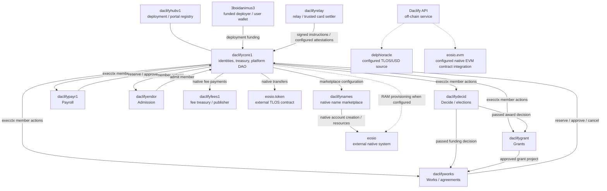

> Historical evidence from the source commits and live read window identified below. This snapshot predates the executive-authority and contract-integration changes; it is not a current deployment audit. See [current development integration evidence](2026-10-09-contract-integration.md).

# Daclify testnet native accounts and permissions

Verified from the live Telos Zero testnet RPC on **9 October 2026, 16:17:06–16:17:12 UTC** (17:17 in Atlantic/Canary). Chain ID: `1eaa0824707c8c16bd25145493bf062aecddfeb56c736f6ba6397f3195f33c9f`. RPC: `https://testnet.telos.caleos.io`. Read window: blocks 449319446–449319455, last irreversible 449319453. This is a multi-request public snapshot, not an atomic state snapshot.

Inventory comes from the testnet deployment configuration, live Hub registration, runtime settings/catalogue/DAO scopes, and live `get_account`/`get_code_hash`. It covers **ten Daclify-owned native accounts**, the funded deployer and four configured external chain dependencies. It does not claim an exhaustive inventory of historical unrelated transactions or external contracts’ transitive dependencies. The Hub currently registers only `daclifycore1`; no independent deployment is registered.

## Operational map

Arrows describe application calls/roles, **not native permission delegation**. In particular, `daclifyrelay` has no delegated `daclifycore1@active` authority. It supplies relay transactions and attestations the runtime permits. Stripe platform/DAO merchant accounts and application UUIDs are off-chain identities, not additional Telos native accounts. EVM integration here is not a trustless cross-chain payout module.

## Common owner and active authorities

All ten owned accounts have the same owner public key, alias **O**:

`PUB_K1_7UgPy96qydxpAFWPMRnmRuNSrtLrVBnbNk5Gc9TfSMwgSxEVJB`

Every owner permission has parent `""`, **threshold 1**, O with weight 1, **no account delegations and no waits**. Every active permission has parent `owner`, threshold 1, its own unique key with weight 1, and no waits. Where the table says self-code, that account also delegates weight 1 to its own `account@eosio.code`. **Key OR code is sufficient; this is not two-signature approval.**

| Native account | Role | Owner | Active authority | Other permissions | Physical RAM free at snapshot |
| --- | --- | --- | --- | --- | --- |
| `daclifycore1` | Shared runtime, identities, treasury, platform policies | O, 1/1 | A1 **or self-code**, 1/1 | `execctx` | 67,626 bytes |
| `daclifyhubv1` | Public deployment and portal registry | O, 1/1 | A2, 1/1 | None | 441,214 bytes |
| `daclifydecid` | Decide, funding votes and elections | O, 1/1 | A3 **or self-code**, 1/1 | None | 67,929 bytes |
| `daclifyworks` | Works, milestones and agreements | O, 1/1 | A4 **or self-code**, 1/1 | None | 65,790 bytes |
| `daclifypayr1` | Fixed-term payroll | O, 1/1 | A5 **or self-code**, 1/1 | None | 199,348 bytes |
| `daclifyrelay` | API relay; trusted creation/card settlement authority | O, 1/1 | A6, 1/1 | None | 14,785 bytes |
| `daclifyfees1` | Native fee treasury and first-party publisher | O, 1/1 | A7, 1/1 | None | 14,785 bytes |
| `daclifygrant` | Grants rounds | O, 1/1 | A8 **or self-code**, 1/1 | None | 67,241 bytes |
| `daclifyendor` | Endorsement admission | O, 1/1 | A9 **or self-code**, 1/1 | None | 207,667 bytes |
| `daclifynames` | Native account-name marketplace | O, 1/1 | A10 **or self-code**, 1/1 | None | 292,292 bytes |

The owner key can recover/change all child permissions. Native contract upgrade and native token-transfer authority remain distinct from internal DAO administrator checks. An internal Daclify DAO vote does not control native `owner` merely because the UI calls that community Daclify DAO. One common owner credential therefore controls all ten accounts. The same O key is one of the two independently sufficient keys in `3boidanimus3@active`. [Antelope permission hierarchy](https://docs.antelope.io/docs/latest/protocol/accounts_and_permissions/).

The Mac `.env.testnet` bootstrap credential was compared by deriving **only its public key**: it matches A1 (`daclifycore1@active`), not O. Its relay credential matches A6. Nothing establishes where the production/server owner credential is stored; that custody was not inspected. No private key, API token or webhook secret is included here.

### Active public key aliases

| Alias | Account | Exact public key |
| --- | --- | --- |
| A1 | `daclifycore1` | `PUB_K1_7ok2fwomKVXNs2cjKayquoT5EVxzLLVtq4bXSJvtL5QYZdu4m2` |
| A2 | `daclifyhubv1` | `PUB_K1_6rVrFKp5wYig4V37bCHmRmTXQH4kKKtppLyqFo5iavsC66FP8m` |
| A3 | `daclifydecid` | `PUB_K1_7zXp7pNqzoxoDipydyMaTCGncMx8oWekCrMBSRLgbt9eds2fh3` |
| A4 | `daclifyworks` | `PUB_K1_64hxhNnDQxqcg8ffC4c8qbCo4mKiaNAtP8x7Bv1PuK6ocGSeLd` |
| A5 | `daclifypayr1` | `PUB_K1_8UtbkcxHvLij7WBFryC4EonBmNpcs87Pq9pvXbaot8h9v8ve6M` |
| A6 | `daclifyrelay` | `PUB_K1_8j1MA7Evt5628RaKn5zF1GPwB3RqY1gXeqxq9z56Cmh7oPsAmg` |
| A7 | `daclifyfees1` | `PUB_K1_5niDjEJrdAoXskaB75PQ5BdBTiW3S7VTJdvuSgoEUvBogUSAs7` |
| A8 | `daclifygrant` | `PUB_K1_54ppWwQiknZc4HA2BmWw33ACYZ6aJNefYrUeb5JBJphpdqjc8k` |
| A9 | `daclifyendor` | `PUB_K1_8MiTQKpsshbq2HiF734kbRUiAHgATZUgNd3E5MW3K5SpcfLref` |
| A10 | `daclifynames` | `PUB_K1_69VqqJriHn5K5KaH78FjXVuge4vj9XtUKaW4NnH7bJJwjEoFsD` |

### Runtime execution permission

`daclifycore1@execctx` has parent `active`, **threshold 1**, **no keys**, one account authority `daclifycore1@eosio.code` of weight 1, and **no waits**. It is linked to the following **actual** 57 contract actions. The authority belongs to runtime; the module accounts themselves have only owner and active.

| Target contract | Actions linked to runtime execctx |
| --- | --- |
| `daclifycore1` | `setdaogov`, `addmember`, `setadmit`, `addsession`, `delsession`, `rotatekey`, `setmeta`, `setprofile`, `putdoc`, `putjson`, `commitepoch`, `rotateepoch`, `linknative`, `unlinknat`, `linkevm`, `unlinkevm`, `setactive`, `setroles`, `grantkey`, `withdraw`, `unstake`, `modconfig`, `setcredits`, `confirmext`, `govfees`, `govcreate`, `govlist`, `govunlist`, `govmodcopy` |
| `daclifydecid` | `open`, `vote`, `openwork`, `openaward`, `newelect`, `nominate`, `startelect`, `recall` |
| `daclifyworks` | `propose`, `accept`, `submitwork`, `review`, `cancel`, `offeragr`, `acceptagr` |
| `daclifypayr1` | `commit`, `edit` |
| `daclifygrant` | `newround`, `applygrant`, `amend`, `submitapp`, `reviewapp`, `closeapp`, `closeround` |
| `daclifyendor` | `applyjoin`, `witness`, `unwitness`, `admit` |

**Missing required links:** `archapprove`, `archrevoke`, `restoredoc`, `govpayfees`, `govhosted`, `govseatfee`, `govresources`, all targeting `daclifycore1`. Without a corresponding link, the action minimum defaults to active. The runtime dispatch declares execctx, which is below active; a matching WASM hash does not repair that declaration. No account has an `eosio.any` wildcard link in this snapshot. Owner/active action-link arrays are otherwise empty.

### External / user-owned accounts

**`3boidanimus3`** — funded deployer/user wallet; not a Daclify contract account.

- `active`, parent `owner`, threshold 1: key `PUB_K1_5LQ6tMoP9F1TRqGBuupNtHzmfvC83e9DQQcb66on68cLK8tBV8` (weight 1); key `PUB_K1_7UgPy96qydxpAFWPMRnmRuNSrtLrVBnbNk5Gc9TfSMwgSxEVJB` (weight 1). Waits: none. No action links.
- `oracle`, parent `active`, threshold 1: key `PUB_K1_5g5EES9ivaSuh3cKj2RzCvv651Dmo5q1FnXioRRKbfAB1vWhs9` (weight 1). Waits: none. Action links: `rng.oracle::submitrand`, `delphioracle::write`.
- `owner`, parent root, threshold 1: key `PUB_K1_7tq5Yf26xjbxqX6wsMJRAHMhRt8J91icxAUw7iUpo4QRAxGqZ3` (weight 1). Waits: none. No action links.

**`eosio`** — native system/resource contract.

- `active`, parent `owner`, threshold 1: key `PUB_K1_51cem57Wm8ua8Hx9CCbc1mJDtko2NEB1jbLWjv5hKdeFoSmuNg` (weight 1); key `PUB_K1_6vnfc2nMt1KvvmXFnCoo7XqASJTJ7p3PD23nnbZH1V6GrfREJ9` (weight 1); key `PUB_K1_7xyPWfh6743fhZ46zQQcXSctddoqG65d44YsyRnCJCs55pEPfN` (weight 1). Waits: none. No action links.
- `owner`, parent root, threshold 1: key `PUB_K1_7xyPWfh6743fhZ46zQQcXSctddoqG65d44YsyRnCJCs55pEPfN` (weight 1). Waits: none. No action links.
- `rngorc.test`, parent `active`, threshold 1: `eosio@eosio.code` (weight 1). Waits: none. No action links.

**`eosio.token`** — configured TLOS contract.

- `active`, parent `owner`, threshold 1: `eosio@active` (weight 1). Waits: none. No action links.
- `owner`, parent root, threshold 1: `eosio@active` (weight 1). Waits: none. No action links.

**`eosio.evm`** — configured native Telos EVM contract.

- `active`, parent `owner`, threshold 1: key `PUB_K1_7jh9wxkHPtxbLhurKRaofLBdkMZhCrymwDR5WFUEZpUxrkxXSB` (weight 1); `eosio.evm@eosio.code` (weight 1); `ethevmcreate@active` (weight 1). Waits: none. No action links.
- `owner`, parent root, threshold 1: `eosio@active` (weight 1). Waits: none. No action links.

**`delphioracle`** — configured TLOS/USD oracle contract.

- `active`, parent `owner`, threshold 1: key `PUB_K1_5p1Ya3QCyzoQhUh7phDfuh8awpwpXMMuXcmkm7L3pPnaPju9Tk` (weight 1); key `PUB_K1_5vTDGVpwpAJtpvVWG4RUKYC8JDBU9xc2F1ekRqZgFf3GohkG8d` (weight 1); key `PUB_K1_8ek6TD4kiwbVdSaCyVN5bbYiK1PusfFUdoq8VkmFJE27dDs7KR` (weight 1); `delphioracle@eosio.code` (weight 1). Waits: none. No action links.
- `owner`, parent root, threshold 1: key `PUB_K1_8ek6TD4kiwbVdSaCyVN5bbYiK1PusfFUdoq8VkmFJE27dDs7KR` (weight 1). Waits: none. No action links.

External authorities are observed, not managed or certified by Daclify. The deployer’s pre-existing oracle links to `rng.oracle::submitrand` and `delphioracle::write` are shown because they are part of that wallet’s authority; they do not establish a new Daclify RNG feature. The `ethevmcreate@active` delegation is part of eosio.evm’s external authority, not a Daclify-owned account.

## DAO scopes, deployment pins and current readiness

Three existing DAO IDs share the same runtime account and its native authorities:

- `1`: Daclify DAO, owner field `daclifycore1`, 1 active member(s).
- `4899240341166052780`: Daclify testnet smoke DAO, owner field `daclifycore1`, 1 active member(s).
- `10462019581746745784`: Daclify testnet Stripe smoke DAO, owner field `daclifycore1`, 1 active member(s).

These are table scopes, not three more blockchain accounts. Governance membership keys and paired credentials are separate from runtime owner/active. `daclifyfees1` receives native fees; a Stripe application fee instead reaches the platform Stripe account, never automatically that native account.

All five module catalogue hashes and the runtime hash match the current reviewed SDK build. The Hub registration still advertises code `35b7018872391f8eb883b7b75e1ecad91325bceaae77e9207fc5403c4b2838b0` and ABI `e786287e4241c6f5923150ba6e571f5005e71d6fff1864ab0b6642e6f3f34e6b`, while current runtime code is `f40c696e86ab532ca57ea073265a982f694f9f21f8de53300b51365e83711878` and ABI `a7f5fe4b28aa5cd33ac243ee2baf2a9c78dae7f20b9009f35523754c30561051`. Its metadata predates the operator/DAO/portal shape. The public directory also rejects its numeric Boolean; these are separate failures.

Runtime/Decide/Works/Grants each have only about 65–68 KB of physical headroom at this instant. That is an operational snapshot, not a measured DAO capacity estimate. RAM observer, per-DAO pools/quotas and prepaid resource policies are absent. No native permission, fee, balance, code or provider setting was changed during this audit.

[Full raw public snapshot and deployment comparisons](2026-10-09-testnet-account-permissions.json). [Module/payment audit and test boundaries](2026-10-09-modules-payment-audit.md).
