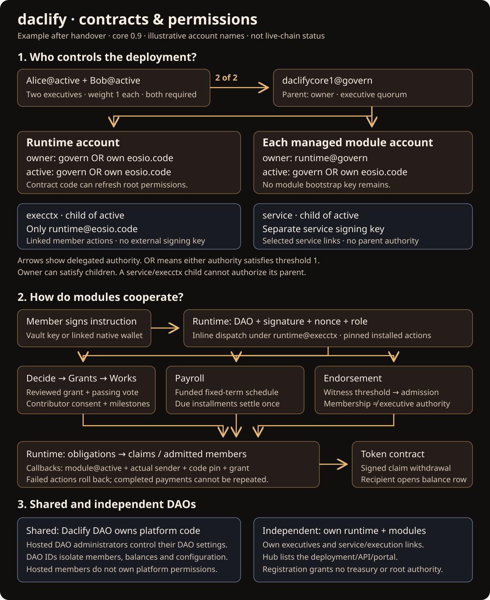

# Smart contracts and permissions

These examples describe the executable model introduced in core 0.13.0-alpha.1. They are **illustrations after a reviewed handover**, not a statement that the current Telos testnet or mainnet accounts have already been changed.

## Shared deployments

The Daclify DAO controls the platform runtime and the module accounts included in its native-governance configuration. Hosted DAOs share that code while their membership, configuration, balances and obligations remain separate by runtime and DAO ID. A hosted DAO administrator manages that DAO's settings; membership or administration does not grant permission to change platform contract code or native account authorities.

## Independent deployments

An independent DAO deploys its own runtime and modules and configures its own appointed or elected native executives. For example, replace `daclifycore1` below with `mydaocore`. An API endpoint or external portal in the Hub is a discovery reference. Hub registration does not grant the Hub control of that DAO's treasury or root permissions.

Sharing a physical module account shares that account's upgrade authority, even though its table rows are isolated by runtime and DAO. A DAO that wants independent upgrade control must own its module accounts too. Independent operators must configure their own execution links and code pins; an app card is not a permission setup.

## Before handover

Each deployment account starts with native `owner` and `active` authorities controlled by the bootstrap operator. Executives are initially appointed by the current DAO deployment authority. Pairing a native account by an ordinary member does not appoint an executive.

`setnativegov` requires the runtime's exact owner permission and fixes the governing DAO, managed accounts, creator recovery account, inline-code roles and separate service public key. The current owners then review and sign the staged owner-delegation actions and `handover` in **one transaction**. At least one appointed, active member with a paired native account is required. The expected creator, policy version, signers, threshold and policy revision prevent a stale handover.

## After handover: example with Alice and Bob

Two eligible active executives, Alice and Bob, and a 100% executive quorum produce:

| Account and permission | Parent | Threshold and permitted authority |
| --- | --- | --- |
| `daclifycore1@owner` | none | 1: `3boidanimus3@active` |
| `daclifycore1@active` | owner | 2: `alice@active` weight 1 + `bob@active` weight 1 + `daclifycore1@eosio.code` weight 2 |
| `daclifycore1@execctx` | active | 1: `daclifycore1@eosio.code` only; no signing keys |
| `daclifycore1@service` | active | 1: the separate configured service key |
| `works@owner` | none | 1: `daclifycore1@active`; no module bootstrap key |
| `works@active` | owner | 1: `daclifycore1@active` OR `works@eosio.code` |

The managed delegate applies to Decide, Payroll, Grants, Endorsement and explicitly included Hub/Names accounts. Hub has no own-code entry; the modules and Names do. External accounts such as `eosio.token`, the Antelope system contract, and users' wallets retain their own authorities.

A permission parent can satisfy its child. A child does not grant its signers the parent's authority. In particular, possessing the service key does not authorize active or owner operations. The service permission is linked only to the selected creation/bootstrap service actions; enrollment and module installation for the governing DAO still require runtime active authority.

Runtime code carries active quorum weight and transitive ownership of the managed contracts. It can synchronize active but cannot replace creator-only runtime owner. A runtime upgrade therefore changes a privileged deployment-wide trust boundary. Module code has active inline capability on its own account; it has no owner capability through its own code.

## What links to what

The deployment tool creates `execctx` and links the supported runtime member actions and each module's member actions to it. The runtime dispatches a member's validated instruction inline under `runtime@execctx`. Modules additionally verify the actual inline sender, installed action, live code hash, DAO, member status, role and agent restrictions.

Module callbacks use `module@active`, satisfied inline by that module's `eosio.code`. Runtime callbacks additionally require the actual module sender, the pinned code and the particular callback grant. Owning a module key, or even satisfying its active authority with executives, cannot counterfeit an inline callback.

Public lifecycle actions such as ballot finalization and due-payment settlement can be triggered by a relayer. They read the authoritative contract records; the relayer cannot invent approval or bypass a due date.

## Worked flows

1. A member submits a grant application to Grants; a reviewer marks it eligible.
2. Decide records a vote bound to that application, its revision, DAO policy and module code pins.
3. After a passing finalized ballot, Decide calls Grants, which creates the accepted Works project and contribution agreement. Works reserves backed obligations in Runtime.
4. The contributor submits the milestone; a permitted reviewer approves it. Works settlement calls Runtime, which converts the obligation into the member's claim.
5. The member signs withdrawal. Runtime transfers the token under its own active/code authority. The receiving wallet must already have its token balance row and pay for that row's RAM.

Payroll uses the same runtime treasury, obligations and claims. Endorsement calls the narrowly granted admission callback after the configured witness threshold; it does not appoint executives. Ordinary membership can be excluded from voting by the DAO's nonvoter policy. Shared module usage cannot spend a different DAO's available balance.

Failed inline actions roll back the whole transaction, including nonce increments, reservations and execution markers. Retrying an already executed award or settled obligation must not pay twice.

## Elections and inactivity

Only the explicitly designated executive election changes deployment control. Eligible paired native executives contribute one signer each; unpaired or nonexecutive members do not. The configured quorum determines the threshold. Inactive executive weight falls out on a valid refresh/action, and activity restores it; the blockchain cannot refresh itself while no transaction runs.

If all eligible paired executives are inactive, the fallback retains their recovery signers until an eligible executive returns. After refresh that returning executive may become the only active signer. This intentionally permits one active executive to control the deployment. Last-controller unpairing is blocked, while an authenticated atomic wallet replacement remains possible.

## Verification

Run the reproducible local recipe in [contract integration evidence](../evidence/2026-10-09-contract-integration.md). VERT exercises compiled WASM state and rejection paths. The dedicated native suite checks real signatures, permission thresholds, code-authorized inline calls, handover and complete module settlement. Neither establishes a live Telos deployment or external payment/provider availability.

Runtime upgrades require active quorum; creator owner remains a recovery override. Managed code/ABI upgrades require owner, delegated to runtime active, so their own inline code cannot upgrade itself. Hub does not receive own-code authority; configured inline senders do. The service key must not control an executive or creator recovery authority. Legacy nativegov rows lack ownership policy metadata and require an explicit reviewed migration; the new runtime permits existing withdrawal/unstake exits but refuses native controller mutations on those rows. New proposals verify exact WASM and raw ABI release hashes and full permission-link snapshots.

If the creator is also an executive, their owner recovery authority can bypass executive quorum. Keep that distinction visible when assessing native signatures. Testnet creator active currently includes the shared bootstrap key; this handover does not rotate the creator’s own keys.
