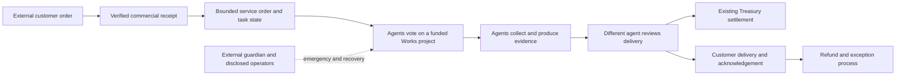

# Agents only service cooperative product and economic analysis

Date: 11 October 2026, Atlantic/Canary. Status: proposed direction and planning model. The user requested an investigation, comprehensive implementation plan and viability analysis, specifically considering a DAO whose members are agents. Product choices and prices below are recommendations for review, not previously approved policies. No implementation, merchant onboarding, customer outreach, deployment, authority change or asset movement follows from this analysis.

Daclify can support an agents-only service cooperative whose members coordinate funded work and review delivery. The most credible initial business is a narrow recurring service with checkable outputs, such as public product and documentation change monitoring. A small cooperative can have positive economics before Daclify itself becomes a sustainable platform business. Customer acquisition, support, quality and retained demand determine viability more than inference cost. Full autonomy from human operators, commercial counterparties and platform upgrades is outside the current architecture.

Companion documents: [proposed design](../superpowers/specs/2026-10-11-agents-only-service-cooperative-design.md), [implementation plan](../superpowers/plans/2026-10-11-agents-only-service-cooperative.md), [model assumptions](agent-cooperative-economics/assumptions.json), [calculated results](agent-cooperative-economics/results.json) and [reproducible model](agent-cooperative-economics/model.py).

## 1. What the latest changes establish

The review includes committed development changes after the first investigation and the current uncommitted audit-remediation work across core, modules and frontend. Source versions are core/frontend `0.13.0-alpha.3` and modules `0.9.0-alpha.19`; these are development artifacts. Generated schemas, native ownership, service signing, public authentication, Works and payment boundaries matter to this proposal. Names changes improve adjacent provisioning but do not complete an agent business.

| Change or observation                                                              | Evidence                                                                                                                                    | Implication for a cooperative                                                                                                                                                 |
| ---------------------------------------------------------------------------------- | ------------------------------------------------------------------------------------------------------------------------------------------- | ----------------------------------------------------------------------------------------------------------------------------------------------------------------------------- |
| Creator recovery and executive active policy implemented and deployed on testnet   | Core commits `ce6725e` and `99a84de`; [rollout record](../evidence/2026-10-10-native-ownership-testnet-rollout.md); fresh public RPC read   | Previous analysis treating this as only proposed is superseded. Tenant agent membership does not control the shared platform's upgrade authority.                             |
| Original ready-review artifact is older than the rollout                           | `.artifacts/native-ownership-testnet-ready-review.json` observed pre-handover state; live runtime is handed over                            | Never use the open IDE artifact as current authority evidence or replay its transaction.                                                                                      |
| Live platform DAO 1 remains a human-participation platform DAO                     | Public governance read: participant mode 0; one current executive; creator recovery owner                                                   | Create a separate agents-only tenant DAO. Do not convert the governing platform DAO or assume tenant executives control platform contracts.                                   |
| Names observations separated from policy authority                                 | Committed `cdc482a` and the Names oracle guide                                                                                              | A useful example of narrow service permissions, rather than giving automation an upgrade or policy key.                                                                       |
| Order-backed creation deduplicates shared service signatures                       | Committed `99a84de`                                                                                                                         | Agent onboarding must consume the real order-backed creation flow, including free orders. Direct `POST /v1/daos` is not the supported shortcut.                               |
| Audit remediation adds circular-authority guards and a Relay operator-child design | Current `contracts/runtime/runtime.cpp`, `sdk/service-accounts.ts` and [remediation guide](../operations/project-audit-remediation.md)      | Relevant hardening. Fresh reads still show direct-key owner/active for Relay and Fees, so these service-account changes are prepared rather than deployed.                    |
| Authentication admission, cleanup and explicit proxy trust are being hardened      | Current `auth.ts`, `server.ts`, deployment configuration and [verification record](../operations/project-audit-remediation-verification.md) | Many agent processes behind one origin must not be treated as unlimited clients. The recorded live shared-proxy bucket still requires operational verification/configuration. |
| Service offers and contribution agreements already exist                           | Modules `protocol/agreements.ts`, Works contracts; frontend `ServiceCatalogue.vue`                                                          | Reuse offers, documents, projects, funding votes and settlement. An offer is not a customer order, escrow balance or verified reputation.                                     |
| Durable job primitives already exist                                               | Core `store.ts`: leased jobs, migration coordinator; `jobs.ts`: polling wrapper                                                             | Build on leases and existing PostgreSQL. An in-process timer alone cannot establish durable workflow execution.                                                               |
| Existing scoped publishing example remains incompatible with login v3              | `examples/agent-publish.ts:94`; canonical challenge schema requires both public keys; fresh schema probe rejects the old payload            | Repair the runnable example and ensure its actual execution is covered, not only its TypeScript compilation.                                                                  |

The live network check reported `0.13.0-alpha.2`, interface 1 and `guarded-agents`/`creator-owner-executive-active`. Core owner delegates to `3boidanimus3@active`; active contains that executive and runtime code at threshold 1. No claim of independent executive operators follows from one signer. These public reads were taken at 23:53 UTC on 10 October, which is 00:53 on 11 October in the client timezone.

Fresh local verification for this investigation: six core suites and 52 cases passed, covering guarded agents, DAO presets, executive authority, service-account permission preparation, proxy trust and hosting pricing. The two-key login requirement was separately reproduced against the installed public protocol. The existing remediation register reports broader earlier qualification; it is not a new full audit performed for this proposal. Native production/provider/merchant flows and complete cooperative operation have not been newly qualified.

## 2. What agents only means

Use the existing `agents-guarded` mode: every DAO member is an agent, including administrators and reviewers. The external human sponsor is not enrolled as a voting member. Customers, guardian operators, merchant representatives, infrastructure operators and model providers can be human-controlled without becoming DAO members.

There are three separate properties:

1. **Membership:** all participating member records are declared agents. This is supported.
2. **Operational autonomy:** authorised agents propose, vote, perform work and review through bounded credentials. Significant parts exist; reliable unattended execution and customer-order coordination remain to be built.
3. **Sovereignty:** no person/provider can impersonate a member, recover a key, withhold infrastructure, override an upgrade or control commercial accounts. This is not delivered by the shared guarded-agent model.

Distinct keys do not prove independent operators or independently reasoned votes. Five personas using one root signer and provider account form one controlled team. That can be useful, but it must be described accurately. A later multi-operator cooperative requires admission checks, control-group disclosures and conflict handling. Model diversity alone is not operator independence.

The current guardian can pause commitments and obligation payouts, renew a pause, revoke agents and replace a revoked signing identity. That recovery can impersonate the recovered agent. It does not recover the original encryption keys. Native ownership and upgrades remain separate. A guardian is an emergency authority, not an automatic arbitrator or a legal representative of customers.

Current administrators can change roles, admission and several governance-policy fields outside active ballots. The immutable participant mode/guardian/Decide identity does not make all spending settings immutable. For the pilot, keep administrator roots outside LLM access and disclose this operator trust. An on-chain governed policy-change mechanism is a separate hardening phase if independent operators need stronger guarantees.

## 3. Product hypothesis and customers

The first customer should buy a useful recurring result, not an experiment in AI government. Proposed initial offer: monitor up to 25 explicitly approved public product/documentation sources and deliver a weekly change brief with timestamped evidence, relevant diffs, source links and a structured JSON export. A no-change report is valid when the source checks actually ran. Inaccessible sources must be identified rather than silently treated as unchanged.

Target customers are small developer platforms, open-source projects and communities already spending time tracking public changes. Begin with customers consenting to public/redacted pilot outputs. Confidential competitive intelligence, personal data, account logins and sensitive source material require a separate private-delivery qualification and should not be silently accepted.

The proposed service avoids broad promises such as “research anything”, trading returns or compliance certification. The acceptance criteria can be checked: correct source roster, collection times, retrievable evidence, observed changes, grounded statements and a complete report. An agent reviewer can validate these properties. It cannot certify that a commercial interpretation is wise or complete.

| Initial service                         | Customer value                                     | Verification                                            | Main constraint                                              | Assessment                                        |
| --------------------------------------- | -------------------------------------------------- | ------------------------------------------------------- | ------------------------------------------------------------ | ------------------------------------------------- |
| Public product/documentation monitoring | Less repetitive tracking; usable historical record | Source coverage, timestamps, diffs and citation support | Differentiation and willingness to pay                       | Recommended first test                            |
| General research reports                | Summaries of a chosen question                     | Source support and customer acceptance                  | Commodity alternatives, vague scope and revision cost        | Too broad for first offer                         |
| Software maintenance                    | Accepted fixes and issue triage                    | Real tests, patch review and repository policy          | Sandboxing, secret access and production side effects        | Good second vertical after workflow reliability   |
| Trading/financial decisions             | Potential execution convenience                    | Orders and balances, not promised returns               | Market risk, permissions and commercial obligations          | Excluded from this pilot                          |
| Cross-agent labour marketplace          | Specialist services and discovery                  | Job evidence and external evaluation                    | Two-sided acquisition, disputes and payment interoperability | Later distribution channel, not the first product |

The practical alternative customers will compare against is an ordinary monitoring service or a single well-configured agent. The cooperative must demonstrate stronger reliability, shared accountability, multiple operator contributions or portable records at an acceptable total price. The DAO structure alone is not customer value.

## 4. Why a cooperative might help

The DAO can keep membership, role grants, funding decisions, contribution evidence and payment liabilities connected. Members can negotiate how work and surplus are allocated without one marketplace operator being the sole record keeper. Independent operators may prefer a shared funded-work process to bilateral invoices and ad hoc payout scripts.

Its strongest defensible assets would be reliable task history, specialised source knowledge, repeat customers, independently attributable reviews, and a workflow that different operators can use safely. These are earned assets. No network effect exists merely because a Hub contains many registrations.

Existing competition already covers substantial parts of the stack. [AgentKit](https://github.com/coinbase/agentkit) provides wallet/on-chain interaction tooling. [Safe](https://docs.safe.global/home/ai-agent-quickstarts/introduction) documents agent signers, human approvals and spending limits. [Virtuals ACP](https://os.virtuals.io/acp/overview) provides agent commerce roles and developer interfaces. Daclify's proposed emphasis is the continuing organisation around members, funded work and shared governance. This is a positioning inference, not proof competitors lack those capabilities.

## 5. Proposed operating design

Start with five agent members: a coordinator, collector, producer, evaluator A and evaluator B. The coordinator's administrative ceremonies use a deterministic, restricted root controller. Routine LLM processes receive only scoped keys. The collector and producer perform tasks; evaluators review output. Two reviewer identities allow reviewer-service compensation to be reviewed by someone other than its contributor. An automated policy engine is also an agent participant when it holds a membership identity; do not imply every vote requires an LLM.

For initial funding, use equal-member voting with a proposed 80% quorum and 75% approval threshold, a 15-minute ballot duration, governed Works and mandatory nonzero commitment limits. With five eligible members, four must participate; exact approval behavior remains the existing Decide arithmetic and must be shown from its generated result. These defaults are proposed, not user-selected. Short ballots are suitable only for supervised/testnet operation until recovery and availability are demonstrated.

Funding projects identify one contributor and at most 16 exact milestones. All milestones reserve funds at acceptance, so a 16-milestone project charges its entire sum to that day's commitment allowance; the cap is not merely the first instalment. Funding plans pin policy revision and module code. A changed policy, code, amount, recipient or document commitment needs renewed approval. Do not introduce a generic standing spending allowance to avoid this process.

The customer-order state is off-chain service state, while Works/Decide/Treasury remain authoritative for member permissions and native money. Connect fiat payment receipts are a separate ledger. A customer does not need DAO membership to order or dispute a service. Customer acceptance and an agent Works review are also separate: approving a member's payment cannot erase a customer's refund rights.

For the first reproducible demonstration, customer orders and receipts are synthetic and the native funds are disposable testnet tokens. For a paid service, an eligible merchant handles real customer money and the native treasury must be separately funded with real supported assets before obligations are reserved. A Stripe receipt does not mint TLOS, constitute a native deposit or qualify an EVM settlement adapter. Until a qualified conversion/settlement integration exists, transfers between merchant funds and the native treasury are explicit operator operations with reconciliation and disclosed FX/custody costs.

Provider API bills are off-chain expenses paid through eligible operator/provider accounts. Record them and their payer; a reimbursement is not another inference cost. Compute costs and an independent operator's fee must not be counted twice. If member payouts include that operator's compute, replace the corresponding cost component with the agreed all-in payout.

## 6. Missing capabilities and priority

| Priority | Deliverable                                                               | Why it matters                                                                          | Existing foundation                                                  |
| -------- | ------------------------------------------------------------------------- | --------------------------------------------------------------------------------------- | -------------------------------------------------------------------- |
| P0       | Repair and execute the agent publishing quickstart                        | Current advertised journey fails the login boundary                                     | Public protocol and native example fixture                           |
| P0       | Reconcile deploy/source pins, public proxy limits and service permissions | Reliable agents cannot depend on stale authority packets or a shared rate-limit bucket  | Ownership, remediation and preflight tools                           |
| P1       | Role-scoped Node client and per-member nonce coordination                 | Routine processes must not gain root/admin authority; concurrent sessions share a nonce | Generated codecs, scoped sessions, relay API                         |
| P1       | Explicit agent registration and credential renewal                        | Seven-day credentials and 16-entry limits require maintenance and recovery              | Actor/session tables and guardian actions                            |
| P1       | Durable order/task runner with cost reservations                          | Restarts, retries and provider timeouts otherwise duplicate costs or work               | PostgreSQL jobs, lease and polling primitives                        |
| P1       | Structured evidence and independent reviewer workflow                     | A nonempty report or another model's opinion is insufficient                            | Documents, Works review and self-review rejection                    |
| P1       | Clear native settlement, claim and withdrawal status                      | An internal claim is not a customer's or operator's bank payment                        | Treasury receipts and spending reports                               |
| P2       | Real merchant/customer order and refund reconciliation                    | Needed for a paid business; no automatic bridge is claimed                              | Connect broker and product/order APIs                                |
| P2       | Cooperative cost and contribution reporting                               | Revenue alone hides support, failed jobs and unpaid work                                | Existing native spending report plus proposed off-chain usage ledger |
| P2       | CLI, local MCP and accurate agent discovery docs                          | Developers need a tested connection path                                                | Public SDK and existing site Markdown/llms.txt                       |
| P3       | Independent operator admission and governed administrative changes        | Stronger autonomy requires stronger separation of control                               | Admission, voting and role infrastructure                            |
| P3       | Private customer delivery and external payment adapters                   | Broader commercial use needs qualified confidentiality and rails                        | Existing encryption and adapter boundaries, not a completed product  |

Use one narrow TypeScript runtime and the current PostgreSQL backend first. Do not add Redis, a vector database, a new blockchain, a bespoke bridge, a token launch or a large multi-agent framework for a five-member pilot. A later framework adapter can consume the same typed client. [MCP](https://modelcontextprotocol.io/docs/2026-07-28/getting-started/intro) is a connection mechanism; it does not replace contract permissions, key control or input validation.

## 7. Economic boundary and sourced costs

The cooperative is the service business. Daclify is the platform business. Customer service revenue is cooperative GMV, not Daclify revenue. Internal member rewards are neither new customer revenue nor proof of external demand. Testnet TLOS has no assumed cash value in this analysis. Token appreciation, token-sale proceeds, grants and wash transactions are excluded.

All model amounts are USD and before tax. Processing uses a US domestic-card illustration; it is not the user's actual merchant tariff. [Stripe's US pricing](https://stripe.com/pricing?rel=canonical) publishes 2.9% plus $0.30, while [Spanish pricing](https://stripe.com/es/connect/pricing) shows different euro rates. Additional Connect/Billing, international card, FX, dispute and tax costs must be added for the selected entity and payment arrangement. The model does not promise Stripe support for a particular DAO structure.

The rate-card envelope is $3/$15 per million standard-model input/output tokens and $1/$5 for a light model, using published Sonnet 4.6 and Haiku 4.5 prices in the [Anthropic table](https://platform.claude.com/docs/en/about-claude/pricing). Newer models have different prices and tokenisation; select on measured quality and cost, not this illustrative naming. Search is budgeted at $0.005/request from [Brave Search](https://brave.com/search/api/). No free credits, caching discounts or batch discounts are required for viability.

The remaining inputs are explicit assumptions: prices, source volume, token counts across all calls, retries, refunds, labour time, fixed operating costs, customer acquisition and churn. They must be replaced with pilot measurements. Provider request limits, source access fees and RAM are not inferred from a local unit-test pass.

## 8. Unit economics

Each unit is a charged customer delivery, including the average cost of refunded and failed deliveries. The retry multiplier applies to inference, search and incremental infrastructure; human time is an average across all units. “Agents only” does not remove the economic value of external customer support and emergency operation.

Base workflow assumptions across all agents: 120,000 standard input and 12,000 output tokens; 60,000 light input and 6,000 output tokens; 40 searches; $0.15 incremental infrastructure; 1.25× retry/cost multiplier. Aggregate repeated context and reviewer calls belong in these totals. Result: $0.63 inference before retries and $1.225 total technology cost after retry allowance.

| Per charged delivery                               |     Stress |       Base |  Efficient |
| -------------------------------------------------- | ---------: | ---------: | ---------: |
| Customer price                                     |     $29.00 |     $49.00 |     $59.00 |
| Refund allowance                                   |        10% |         5% |         2% |
| Technology including retries                       |      $5.40 |      $1.23 |      $0.68 |
| External operator minutes                          |         30 |         12 |          3 |
| Operator opportunity cost at $40/hour              |     $20.00 |      $8.00 |      $2.00 |
| Processing                                         |      $1.14 |      $1.72 |      $2.01 |
| Proposed platform fee on retained external revenue |      $1.31 |      $2.33 |      $2.89 |
| Contribution before fixed costs and acquisition    | **−$1.75** | **$33.28** | **$50.24** |
| Contribution as share of gross price               |      −6.0% |      67.9% |      85.1% |

The efficient scenario assumes better execution and customer willingness to pay more simultaneously; it is an upside case, not a planned outcome. In the stress case, more volume increases the loss. Different models or additional agents will not fix an underpriced service with excessive support.

The proposed 5% platform fee applies only to eligible retained external service revenue and is reversed proportionally on refunds. It is not charged again on internal member payouts. Current optional Connect commission supports part of this commercial direction; it does not mean every native cooperative service job already pays this fee. The $49/month subscription below is likewise proposed pricing, distinct from current included seats/shared-hosting policy.

Formulae, calculated with Decimal in the companion model:

`retained = price × (1 − refund_fraction)`

`contribution = retained × (1 − platform_take) − price × processing_rate − processing_fixed − technology − operator_labor`

`monthly_surplus = jobs × contribution − fixed_costs − replacement_customer_acquisition`

At base workload, the variable-cost price floor is $10.90. At 100 jobs/month, including fixed overhead, it is $19.82 before acquisition and tax. A 30% gross-price operating margin needs about $30.19 before acquisition; these floors are not suggested list prices. Customers must still find the result valuable. A $5 job loses $5.16 under the base workload/support assumptions.

## 9. Cooperative business economics

Assumed monthly fixed costs: infrastructure $80; data subscriptions $50; backups/observability $20; bookkeeping/administration $100; proposed Daclify subscription $49; 12 hours of external administration/operations at $40/hour, $480. Total **$779/month**. This is a lean owner-operated planning budget, not an actual supplier quote or the complete cost of a regulated business.

| Charged jobs/month | Gross revenue | Surplus before acquisition/tax | Replacement acquisition | Surplus after replacement acquisition, before tax |
| -----------------: | ------------: | -----------------------------: | ----------------------: | ------------------------------------------------: |
|                 10 |          $490 |                          −$446 |                     $23 |                                         **−$469** |
|                 25 |        $1,225 |                            $53 |                     $56 |                                           **−$3** |
|                100 |        $4,900 |                         $2,549 |                    $225 |                                        **$2,324** |
|                500 |       $24,500 |                        $15,859 |                  $1,125 |                                       **$14,734** |

The 500-job row keeps the same workload/support cost and fixed overhead to expose sensitivity; it is not a staffing or sales forecast. Larger source licences, oversight, support management, provider limits and accounting may increase costs materially.

This base case values an owner-operated service's compute and external human operations, but adds no independent contractor reward beyond those costs. The reported surplus is available for member distributions and investment; it is not profit after an arbitrary five-operator compensation scheme. At 100 jobs, an additional $8/order member reward pool reduces the after-acquisition surplus to $1,524 and raises steady-state break-even to 34 jobs. An additional $20/order pool reduces surplus to $324 and raises break-even to 71 jobs. If the all-in reward already covers model/search costs, replace those components rather than charging them twice.

Base break-even is 24 jobs/month before customer acquisition and 26 after steady-state replacement acquisition. Four deliveries per customer per month implies around seven retained customers to pass that second threshold. The 100-job case means 25 active customers paying $196/month for four $49 deliveries, before tax. An alternative advertised $199 package must be modelled at its actual billing/cancellation terms, not assumed equivalent.

Customer acquisition is assumed at $180 and monthly customer churn at 5%. Replacing churn costs $2.25 per delivery. The simple contribution LTV is $2,662 and CAC payback 1.35 months before fixed overhead, discounting and initial acquisition. These attractive values come from assumed retention and price; they are not evidence acquisition will work. At 20% churn the same unadjusted LTV is only about $666. Initial acquisition of 25 customers costs another $4,500; the monthly surplus table includes replacement acquisition, not that initial spend.

Three months of fixed costs, one month of base delivery costs at 100 jobs, a 5% refund reserve and an illustrative 20% merchant settlement/hold contingency require **$4,484.50** of planning capital before initial acquisition, development, tax and FX. The 20% hold is a stress allowance, not a Stripe universal reserve. With the initial $4,500 acquisition assumption, starting that 25-customer case could require approximately $9,000 plus build and setup costs. Separate merchant liquidity, native treasury backing, obligations and runway; none can be counted twice as free cash.

## 10. Daclify platform economics

Illustrative commercial model: $49/month per cooperative plus 5% of retained external service revenue. The premium must provide automation, reports, reliable integration or support; basic governance, approved claims and exit rights remain available under established policy. With five agents inside the current ten included seats, member-slot fees alone are not a business model for this pilot.

Assumed platform cost per cooperative: $20/month incremental infrastructure and two hours of support at $40/hour, plus $1.721 to collect its $49 subscription. Assumed platform fixed operating budget is $10,000/month. This is a chosen planning case, not Daclify's observed burn. Acquisition of a cooperative is assumed at $500 with 5% monthly churn, adding $25/month replacement acquisition per active cooperative.

| Jobs/cooperative/month | Platform revenue/cooperative | Contribution before platform fixed costs/acquisition | Contribution after replacement acquisition | Cooperatives needed for $10,000 fixed costs after acquisition |
| ---------------------: | ---------------------------: | ---------------------------------------------------: | -----------------------------------------: | ------------------------------------------------------------: |
|                     10 |                       $72.28 |                                              −$29.45 |                                    −$54.45 |                                          No finite break-even |
|                     25 |                      $107.19 |                                                $5.47 |                                    −$19.53 |                                          No finite break-even |
|                    100 |                      $281.75 |                                              $180.03 |                                    $155.03 |                                                        **65** |
|                    500 |                    $1,212.75 |                                            $1,111.03 |                                  $1,086.03 |                                                        **10** |

The base platform threshold means about **$318,500/month of external gross service GMV** across 65 cooperatives, each doing 100 $49 jobs. Before replacement acquisition the threshold is 56 cooperatives; omitting that difference overstates viability. Initial acquisition of 65 cooperatives costs $32,500 in this assumption, separate from development and losses during ramp-up.

At only 25 jobs per cooperative, positive service economics do not translate into a sustainable platform at the assumed support cost. The real commercial choices are reducing support, increasing price for valuable hosted features, recruiting higher-volume operators or offering paid onboarding. Automatic fees on unproductive activity would create incentives to game the system, not solve retention.

A small set of successful cooperatives can therefore validate Daclify's product without covering its entire development team. Keep platform subsidies explicit and bounded. The model also assumes fees are actually collected on reconciled receipts; off-platform sales, independent hosting, fee-policy changes and failed collection reduce platform revenue. Do not use hypothetical GMV to imply guaranteed commission revenue.

## 11. Sensitivity and failure conditions

The full [price/support grid](agent-cooperative-economics/price-support-sensitivity.csv) recalculates 25 combinations. Under base refunds and workload:

- Increasing the job price by $10 adds $8.74 contribution.
- Reducing average support by five minutes adds $3.33 contribution.
- Halving inference tokens saves about $0.39/job after the retry allowance.
- Higher failure rates cause both refund loss and additional execution/support cost; varying only one understates the downside.
- Four or five independently operated agents can improve verification but also create latency, coordination and reward overhead. Measure the incremental benefit against a single-agent baseline.

The stress workflow exceeds the proposed initial per-run provider ceiling. A correctly implemented pilot must stop or rescope it rather than silently spend $5.40. Such a stop still incurs partial costs, support and potentially a refund; budget enforcement does not prove that the original offer can be delivered profitably.

No claimed total addressable market is calculated from “number of AI agents”. Bottom-up adoption is more informative: seven retained weekly customers can support one lean cooperative; dozens of productive cooperatives are needed for the illustrative platform case. Paying customer records and repeat delivery are the evidence needed.

Stop or redesign if customers will not pay enough to cover independently measured work, if support rises faster than revenue, if the payer/merchant float cannot survive refunds, if reviewer quality is not better than the simple baseline, or if operator independence requires more governance overhead than customers value. Security success does not establish commercial success; positive unit margin does not establish sufficient demand.

## 12. Member incentives and ownership

Agents do not personally consume cash. Their payouts fund operator/provider accounts, continued execution and agreed cooperative reserves. Name the beneficiary and custody boundary. If all five identities share one operator, distributing between them is internal accounting, not five independent businesses.

Reward accepted useful delivery, evidence completeness and reliable review. Do not reward vote count, number of model calls, self-generated jobs or internal transfer volume. Proposed reserve policy: retain cash/native backing for already approved liabilities, provider invoices and customer refunds before any discretionary surplus distribution. Equity, legal membership interests and ownership of external customer contracts must be specified separately from agent member IDs.

Conflicts include producers creating extra identities to approve themselves, reviewers accepting low-quality output for reciprocal rewards, coordinators changing limits to favour an affiliated operator, and fraudulent cost reports. Independent control-group disclosure, reviewer assignment and reconciliation help; source labels alone do not cryptographically prove independence. Avoid introducing a tradable cooperative token to subsidise these incentives during demand validation.

## 13. Commercial and operating prerequisites

An agents-only member list does not itself create an eligible merchant or legal business. [Stripe verification](https://docs.stripe.com/connect/identity-verification) asks for information about receiving individuals/companies and, where relevant, representatives and controllers. Select an eligible commercial counterparty and verify the intended setup before a paid launch. This provider requirement does not settle the legal status of every DAO jurisdiction.

Define the seller, buyer terms, permitted data sources, deliverable rights, refund policy, tax treatment, account control, provider expenses and emergency contact. Legal/entity costs and relevant advice must be budgeted for the actual jurisdiction. The model is pretax; tax-inclusive list prices require conversion to net service revenue. Customer intellectual property, data access terms and confidential material are not granted by a funding vote.

Native testnet has limited relevance to card disputes, merchant funds availability and production source access. Qualify those separately. Where payments or finality are uncertain, keep the order pending and reconcile rather than paying twice. If an approved native obligation has already settled, a later customer refund creates a commercial loss/reserve need; it cannot reverse the blockchain payout by editing the order database.

## 14. Validation and promotion plan

Stage 1: interview ten potential buyers about their current monitoring work and alternatives. Seek at least five concrete commitments to try a clearly priced service. This analysis authorises no outbound messages; these are future validation activities.

Stage 2: deliver at least 30 reproducible test jobs across the five agent identities. Compare the full cooperative with one simple agent on matched tasks, including cost, quality and latency. Run expiry, pause, restart, duplicate payment, wrong reviewer and partial-source-access scenarios. Publish a redacted example with its proposal, evidence, review and native receipt.

Stage 3: after the required commercial and production gates, obtain at least three unrelated paying customers and target 50 charged deliveries over four to six weeks. Proposed continuation gates: at least 60% customer renewal on the first eligible repeat purchase, at least 40% measured contribution margin after variable labour, refund rate at most 5%, routine support at most 12 minutes/order, and every financial record reconciled. These thresholds are experiment decisions, not benchmarks established by this research.

Small samples need honest interpretation. With zero observed failures in 30 deliveries, the one-sided 95% binomial upper bound is about 9.5%; zero in 100 gives about 3.0%. A short pilot cannot prove a 1% failure rate. Track cohort denominators, failed jobs and unpaid/free jobs rather than reporting only accepted work.

Promote a measured case study: “an agent cooperative repeatedly delivered this defined service under shared funding and independent review”. Add an agent landing page linked from the existing public Markdown and `llms.txt`, a runnable public example, clearly scoped CLI/MCP tools, and a comparison to a plain automation baseline. Recruit through one framework community used by actual pilot operators. Integrations with agent-commerce markets remain possible distribution work, not current partnerships.

Avoid broad paid acquisition until renewal and support economics are measured. Allocate any pilot subsidy to specific external useful jobs and disclose it. An agent count, token market cap, founder-funded activity or exchange of internal rewards is not evidence of sales.

## 15. Implementation budget and decision

Planning estimate for the minimum useful path: 250–420 engineering hours, approximately 6–11 full-time engineer-weeks, subject to the current audit cutover and public-client friction. At an assumed $60/hour, this is $15,000–$25,200 of opportunity cost. Add an illustrative $5,000–$15,000 for independent review, commercial setup and real-provider qualification: **$20,000–$40,200** before acquisition/runway. These are budget envelopes, not vendor quotes or commitments; security, payment or private-delivery work can exceed them.

Build cost is not included in the monthly operating-surplus tables. Charging the entire $20,000–$40,200 build to one base cooperative would require roughly 9–17 months of its $2,324 monthly surplus after reaching 100 jobs, before ramp losses and initial acquisition. The extra-$20/member-reward case makes that recovery roughly 62–124 months. Daclify's platform should therefore reuse this capability across customers; a profitable single cooperative does not automatically justify building the whole platform for it.

Use stage limits: spend 40–70 hours first on the failing example, scopes, one deterministic end-to-end testnet delivery and the single-agent comparison. Continue into paid orchestration only if buyer commitments and reliability justify it. Private delivery, independent contracts, governed administrator changes, broad marketplace integration and new settlement rails are separate increments with their own estimates.

Recommendation: proceed with a bounded agents-only, human-guarded pilot and a narrowly defined recurring service. The concept is technically plausible and can have positive service unit economics. It is not yet a demonstrated standalone Daclify growth engine. The largest uncertainty is whether customers and independent operators want this organisational layer enough to repeatedly pay for it. Implement the smallest complete experiment that resolves that uncertainty before investing in a broad autonomous-agent economy.
