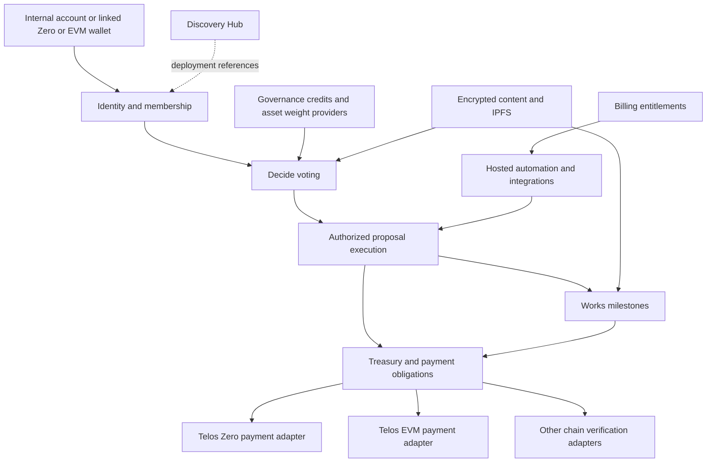

# Daclify V2 Master Implementation Plan

> **For agentic workers:** Use `superpowers:executing-plans` to execute bounded work packages in dependency order. Use `superpowers:subagent-driven-development` only when delegation has been explicitly authorized. Track execution with the checkboxes in the work-package plan. The user requests one continuous implementation session and reviews the complete code afterward; internal checkpoints do not require repeated user approvals. This document records requirements, not implemented features or passing checks.

**Goal:** Rebuild Daclify as a modular DAO platform with Antelope C++ contracts, a strict TypeScript application, internal and blockchain identities, native and internal governance tokens, shared and independent deployments, optional encrypted content, and extensible payment adapters.

**Architecture:** Separate repositories own the frontend, backend core services, and backend modules. Telos Zero is the initial authoritative governance layer. A discovery Hub connects deployments that implement the same versioned interfaces; frontend and modules consume versioned schemas and generated SDK releases from core and the relevant module producer.

**Tech Stack:** Antelope C++; a reproducible stable CDT toolchain selected against Telos deployment compatibility; Vue 3 with Vite, Vue Router, TypeScript strict mode, Pinia, WharfKit, an EVM wallet adapter, a TypeScript API/relayer, IPFS with Pinata pinning, VERT, native-chain integration tests, EVM tests, and browser tests. Each repository pins its own dependencies and toolchain. Quasar is removed from the V2 frontend.

## Reading order and status

This is the programme plan for the whole rebuild. The companion documents contain the architecture and the independently deliverable work packages:

1. [Architecture and product specification](../specs/2026-10-05-daclify-v2-architecture.md).
2. [Work packages and acceptance criteria](2026-10-05-daclify-v2-work-packages.md).
3. [Foundation readiness execution plan](2026-10-05-daclify-v2-foundation-plan.md).
4. [Verified evidence and outstanding risks](2026-10-05-daclify-v2-evidence-and-risks.md).
5. [Versioning, product documentation, Pinata and test policy](2026-10-05-daclify-v2-release-docs-test-policy.md).

Status: the three private V2 repositories have been created; core owns the version-controlled plan. Application implementation has not started. A detailed executable code plan is produced for each work package after its dependencies and interface decisions are verified. This avoids pretending that complete implementation code can be specified today for unverified wallet, key-management, and cross-runtime interfaces.

The current `Daclify` directory contains independent legacy repositories and has no root Git repository. V2 uses the new private repositories [daclify-frontend](https://github.com/Daclify/daclify-frontend), [daclify-backend-core](https://github.com/Daclify/daclify-backend-core), and [daclify-backend-modules](https://github.com/Daclify/daclify-backend-modules), cloned alongside the legacy inputs. Core owns these planning files under `docs/superpowers`; the workspace-level `docs/superpowers` path points to that canonical location. Dependency setup, application code, migrations and deployments remain future implementation tasks.

## Decisions already established

| Decision | Required behavior |
| --- | --- |
| Contract language | Antelope C++, including internal account authorization. Boid's AssemblyScript contract implementation is a reference for behavior, not the implementation language. |
| Application language | Strict TypeScript for UI, API, relayer, SDK, configuration, and integration tooling. |
| Repository boundaries | Frontend, backend core services, and backend modules have separate repositories, lockfiles, CI and release histories. |
| Frontend framework | Vue 3 with Vite, Vue Router and Pinia. Build a small accessible component layer without Quasar. |
| Telos service API | Use the user-supplied [Telos API documentation](https://api.telos.net/v1/docs/index.html) for the services it documents. Native-chain RPC and EVM RPC remain separate validated endpoint types. |
| Account modes | Offer both user-controlled keys and managed key recovery, clearly labelled. Account recovery and content confidentiality are separate concerns. |
| Account compatibility | Support internal accounts with no native account, Telos Zero accounts, and Telos EVM accounts. Broader chain account support uses adapters. |
| DAO deployment | Shared platform contracts with DAO isolation, or DAO-owned contracts using the same interfaces. |
| Hub | Discovery, deployment references, and supported capabilities. Hub registration grants no treasury or governance authority. |
| Governance assets | DAO-owned native tokens and DAO-specific internal governance credits. EVM token support uses an asset/weight adapter. |
| Modules | Small, understandable modules with bounded capabilities, versioned interfaces, validated configuration, and usable presets. |
| Decide and Works | Reimplement useful voting and milestone-funding patterns; do not depend on the old deployed Telos services for ordinary Daclify membership. |
| Storage | Typed contract state for decisions and accounting; bounded JSON metadata for small descriptive data; IPFS CIDs for larger content. |
| Pinning provider | Pinata. Backend credentials, authorized bounded uploads, retrieval/integrity verification and explicit retention/export behavior. Encrypt private documents before pinning. |
| Version management | Independent semantic releases plus explicit interface/data versions, immutable tested release manifests and authorized state migrations. |
| Product documentation | Generate references from canonical schemas/ABIs/manifests; deliver explanatory guides, contextual help and documentation matching the connected DAO/module versions in the UI. |
| Privacy | Encrypt protected content before publication. DAO admission policy determines whether managed decryption-key custody is allowed. |
| Monetization | Usable free governance; paid hosted Operations features and resource allowances; specialist modules and services where demand exists. |
| Tests | Extensive meaningful unit, regression, property/state-machine, fuzz, VERT, native-chain, API/provider/database, EVM, migration and browser/accessibility tests. Required suites cannot silently skip or execute zero cases. |
| Implementation and review | One continuous implementation session with internal verification and progress updates. User reviews the complete code afterward; production release remains a separate expressly authorized action. |

## Recommended defaults and decisions that remain open

These are proposed defaults, not claims that the user selected them.

| Item | Proposed default | Decision point |
| --- | --- | --- |
| Internal governance-credit transfers | Nontransferable. A separate explicit policy can enable transfers after ballot-weight and checkpoint rules are tested. | Before governance-credit ABI freeze. |
| New members and historic private documents | DAO chooses at creation; ordinary collaboration preset grants full history, restricted-project preset grants future access only. The UI requires acknowledgement of this policy. | Before encrypted-content pilot. |
| First social provider | Google OIDC plus Telegram account linking and Mini App authentication; add other providers through the same interface. | Before identity-service implementation. |
| User-controlled key vault | Browser-owned signing and encryption keys with an encrypted recovery credential; passkey unlocking where verified, with a tested fallback for unsupported clients. | Identity feasibility gate. |
| Managed key provider | Separate managed signing and encryption-key services using a production key-management provider; provider selected by curve support, recovery, export, auditability, residency, and cost evidence. | Managed-custody feasibility gate. |
| Paid checkout | DAO-level hosted subscription. Select card/crypto payment rails after target-customer interviews and operating-cost measurements. | Before billing integration. |
| Other-chain verification | First provide explicit DAO-confirmed settlement; add attested or contract-verified adapters separately. | Each external-chain adapter gate. |
| Network rollout | Local chain, public testnet, constrained mainnet pilot, then general availability. | Release gates below. |

No unresolved choice may be hidden behind a default if it changes who can sign, decrypt, upgrade, or spend. Each implementation plan records the chosen policy before coding that boundary.

## Why a new version rather than an in-place upgrade

The audited frontend is an archived demo with JavaScript application code, dummy data, obsolete dependencies, exposed key literals, and no meaningful automated application suite. The C++ contracts need correctness and permission work as well as compiler modernization. The previous document mechanism reconstructs content from transaction/block history instead of persisting a durable document record. See the [evidence register](2026-10-05-daclify-v2-evidence-and-risks.md) for scope and limitations.

Recommendation: preserve useful workflows and assets, implement the new domain model and authoritative contract interfaces in V2, and migrate verified data through explicit import tooling. Incrementally copying the old frontend and authorization conventions would preserve the most expensive defects.

Three implementation approaches were considered:

| Approach | Advantage | Main cost | Recommendation |
| --- | --- | --- | --- |
| Upgrade all legacy repositories in place | Familiar paths and existing screens. | Internal accounts, privacy, deployment modes, and type changes cut across incompatible existing assumptions. | Use only for urgent isolated legacy maintenance. |
| Separate frontend, core and modules repositories with staged migration | Clear ownership, independent releases and reusable modules. | Requires versioned schema/SDK distribution and cross-repository compatibility checks. | Selected repository design. |
| General-purpose multichain plugin platform from day one | Broad future flexibility. | Large verification, custody, compatibility, and operating surface before a useful DAO exists. | Define adapter boundaries now; implement chains individually. |

## Repository ownership and compatibility

| Repository | Owns | Release boundary |
| --- | --- | --- |
| `daclify-frontend` | Vue application, accessible components, module screens/configuration, client key vault/encryption and wallet integrations. | Static application release consuming pinned public SDK/schema/module artifacts. |
| `daclify-backend-core` | Core C++ contracts, Hub, identities/roles, credits/treasury primitives, API, custody services, relayer/worker host, database, shared protocol schemas, generated SDK and core deployment/migration tooling. | Core services/contracts plus versioned public protocol/SDK artifacts. |
| `daclify-backend-modules` | Decide, Works, payroll, chain adapters and additional module contracts, handlers/jobs, configuration schemas, migrations and their tests. | Module releases declaring compatible core protocol/API/ABI versions and bounded capabilities. |

Core owns common record and host interfaces. Each module owns its action ABI and configuration schema, publishing generated artifacts for consumers. Frontend consumes those public artifacts instead of importing private backend code or maintaining guessed duplicate types. Module UI components remain reviewed code in the frontend repository.

Each repository has an independent lockfile and CI. A release manifest pins the frontend, core, module, protocol, SDK and deployed ABI/code versions tested together. Producer CI verifies generation and schema compatibility; consumer CI runs contract fixtures and integration checks against supported releases. Breaking changes require a new interface version, migration/compatibility window and coordinated release. Development can use temporary local package overrides; production builds use pinned released artifacts. No additional shared-types repository is required initially.

The [release/documentation/test policy](2026-10-05-daclify-v2-release-docs-test-policy.md) specifies immutable releases, persisted-state compatibility, bounded/resumable migrations, documentation generation and version-aware UI help. Reference docs and explanatory guides ship with the tested release. A repository tag alone cannot determine how to decode old rows, validate old signatures or explain an older module's defaults.

Separate repositories do not require a service per module. The core service host can load explicitly enabled versioned module handlers/jobs under the manifest's permissions, and deployable C++ modules retain their on-chain boundaries. Isolate a process when key authority or measured operational requirements warrant it.

## Module and deployment outline

The arrow from hosted automation to execution means submission of an already-authorized operation. It grants no additional execution authority. Modules may be packaged together while retaining these boundaries; contract splitting is driven by authority and upgrade isolation rather than by the diagram alone.

Both deployment modes must pass the same conformance suite. A DAO-owned deployment must continue working through a direct deployment URL and SDK connection when the public Hub or hosted Daclify services are unavailable. Self-hosted compatible relayers and content services must be documented for user-controlled accounts. Managed accounts necessarily depend on the selected managed provider until their keys and custody mode are migrated.

## Release sequence

| Stage | Deliverable | Dependencies | Exit gate |
| --- | --- | --- | --- |
| P0 Foundation readiness | Audit baseline, threat model, stable compiler selection, VERT/native harness plan, identity and managed-key prototypes, repository and ABI strategy. | Current research. | Critical interfaces and custody constraints demonstrated; blockers assigned. |
| P1 Platform foundation | Versioned schemas, generated SDK, shared/independent contract skeletons, DAO registry, permissions, module manifest/configuration, strict TypeScript application shell, CI. | P0. | Two isolated test DAOs and an independent deployment pass conformance and authorization tests. |
| P2 Identity and membership | Internal accounts, native linking, user-controlled and managed custody, social login, Telegram authentication, recovery, scoped sessions. | P1 and custody prototypes. | Real identity/recovery flows pass supported-browser tests and adversarial contract tests. |
| P3 Native DAO governance | Internal credits, native-token staking/weight policies, treasury, proposals, Decide ballots, executor, roles/committees, durable public content. | P2. | A walletless member and a native member can govern a DAO without duplicated weight or unauthorized spending. |
| P4 Useful product modules | Works milestone grants, recurring payroll, private content, DAO setup presets, dashboard, operational controls. | P3 and privacy prototypes. | Complete public and private DAO flows pass; monetary liabilities reconcile. |
| P5 EVM support | EVM account linking and signed actions, contract-wallet capability, EVM treasury/vault isolation, supported EVM assets, verified Telos EVM payment settlement. | P2/P3; runtime compatibility prototype. | Cross-runtime tests confirm success, revert, replay, gas exhaustion, and reconciliation behavior. |
| P6 Hosted Operations | Automation, notifications, integrations, DAO-level billing, quotas, managed-service cost controls, retention/export behavior. | Stable P3/P4 flows. | Entitlements affect paid services without withholding keys, exports, treasury access, or approved obligations. |
| P7 Migration and launch | Data inventory/recovery, dry runs, independent deployment kit, security review, operational runbooks, constrained mainnet pilot, release documentation. | Launch-required P1-P6 scope. | Release checklist satisfied and pilot evidence reviewed. |
| P8 Additional chains | One bounded payment/account/asset adapter at a time, beginning with a customer-backed use case. | Stable adapter interfaces and verified verifier model. | Chain-specific finality, proof, replay, and authority tests pass. |

EVM authorization may be developed alongside P3 once P2 interfaces are stable. Hosted billing can be developed alongside P5 once entitlement policy is fixed. These are development concurrency opportunities, not permission to skip dependency gates or an instruction to spawn agents.

## First release scope

The first generally available version includes both DAO deployment modes; internal and Telos Zero membership; user-controlled and managed account modes; social and Telegram entry points; internal credits and native token governance; proposals, ballots, committee roles, treasury transfers, basic Works, basic payroll, durable documents, optional encrypted member content, a usable TypeScript UI, and deployment/migration documentation.

Telos EVM wallet membership and signed governance actions are release goals. EVM payments, ERC-20 voting, and contract-wallet validation are capability-gated: expose only the combinations that passed P5. If settlement is not ready, the UI must clearly show supported governance actions and available payment destinations rather than claiming complete EVM support.

Other-chain accounts and payouts are an extension release. The first release defines their interfaces and can record DAO-confirmed external payments with explicit verification labels. It must not advertise trustless external settlement before a corresponding verifier exists.

Initial paid Operations scope: hosted scheduled execution, Telegram notifications, selected webhook integrations, reporting/export conveniences, and measured relay/pinning/storage allowances. Basic manual governance and safe access to DAO funds remain usable without a subscription.

Excluded from first release: secret on-chain vote tallies, hidden membership or transfers, arbitrary third-party frontend code execution, an open plugin marketplace, ranked/quadratic voting, a maintenance-worker economy, generic trustless support for every blockchain, complex tokenomics, speculative microservices, and a native mobile application. A responsive web application and a tested Telegram Mini App cover the initial clients.

## Required end-to-end scenarios

- [ ] A new user signs in through a social provider, creates an internal account, chooses a custody mode, receives governance credits, votes, and accesses an authorized document without creating a native account.
- [ ] A managed user recovers access after losing a device; service authority and recovery events are visible. A user-controlled user recovers with their recovery credential, while social login alone cannot decrypt their vault.
- [ ] A native wallet user links a Zero account to an existing identity; credits, membership, and existing votes are preserved without duplication.
- [ ] An EVM wallet user signs a DAO instruction; a relayer submits it; the C++ contract validates identity, target, nonce, expiry, and DAO permission.
- [ ] Two DAOs in a shared deployment use identical local proposal IDs and token labels without reading, modifying, voting in, or spending from each other's state through an authorized application path. Public blockchain data remains publicly observable.
- [ ] An independent DAO connects to the Hub and also operates directly with the Hub unavailable. Its upgrade and treasury authority remain under its own policy.
- [ ] A member creates a milestone grant, members approve funding, the proposer submits a report, authorized reviewers accept the deliverable, and one permitted payment settles the obligation.
- [ ] Cancellation releases only uncommitted or explicitly cancellable funds. Retry, duplicate submission, worker restart, and partial service failure never duplicate payments.
- [ ] A native-token holder stakes for governance; the configured lock/checkpoint policy prevents the same tokens from generating duplicate voting power.
- [ ] A private DAO encrypts content before publishing. An excluded member, another DAO, and an operator without keys cannot decrypt it under the user-controlled-only policy. Managed members are rejected under that policy.
- [ ] Membership removal rotates access for future documents; tests demonstrate that already-disclosed historic content cannot be revoked.
- [ ] A subscription expires while payroll and grants have approved obligations. Manual execution, withdrawal, export, and key recovery/access continue under the documented custody policy.
- [ ] An external payment reference is recorded as evidence, then accepted under the chosen verifier policy. A reused, reverted, insufficiently final, wrong-asset, wrong-recipient, or wrong-obligation reference is rejected.
- [ ] Migration tooling reports irrecoverable documents and unresolved liabilities without fabricating content, identities, or settled payments.

## Quality and release gates

### Contract correctness

Authorization, balance conservation, scoped isolation, nonce uniqueness, payment idempotency, ballot immutability, weight checkpoints, reserved-fund conservation, and bounded cleanup are executable invariants. Amounts use integer units with explicit precision; threshold arithmetic uses bounded integer ratios and checked wider intermediates. Floating-point arithmetic is not used for financial or ballot decisions.

The new contract ABI is generated from C++ declarations. SDK types are generated from that ABI. API request schemas are canonical runtime schemas with inferred TypeScript types; adapters validate external data as `unknown` at the boundary. Application code does not use `any`, unchecked casts, or error-suppression comments to satisfy the compiler.

### Test layers

VERT covers fast action/state tests and real C++ WASM. Native-chain integration covers permission evaluation, inline authority, system actions, notification routing, resource limits, and runtime semantics that VERT does not implement. EVM tests cover Solidity/ABI behavior. Cross-runtime tests cover the actual Zero/EVM interaction. API and browser tests cover recovery, permissions, setup, content decryption, and payment status.

A mocked cryptographic verifier or an unimplemented intrinsic is never counted as an integration pass. Mainnet money flows require both local integration evidence and a public-testnet rehearsal. Coverage percentages supplement behavioral invariants; they do not establish treasury safety.

### Security and operation

Before mainnet funds: independent review of authorization, custody, upgrades, balances, private-content keys, and bridge settlement; reproducible build artifacts; published code/ABI hashes and deployment authorities; exercised incident and restoration runbooks; limited pilot exposure; and monitored reconciliation.

The shared operator's contract upgrade authority affects every tenant. The deployment policy must disclose that authority, use a documented governance-controlled upgrade process and delay where feasible, and provide a migration/exit path. A timelock inside an upgradeable contract does not prevent an account owner from bypassing it through native authority changes; test and disclose the actual permission graph.

## Migration plan

1. Inventory deployed contract accounts, authoritative keys/permissions, tables, assets, open proposals, unpaid payroll, and external content. Verify current deployment state instead of equating local source with deployed WASM.
2. Define which legacy features are preserved, redesigned, or intentionally retired. The mapping lives in the work-package plan.
3. Export state with block/chain references and checksums. Reconstruct historic documents only where history providers or original content actually supply the data.
4. Generate a migration report identifying recovered records, missing content, unresolved members, pending obligations, and unsupported configurations.
5. Import into test deployments using canonical versioned records; compare balances, ownership, permissions, document contents, and payment obligations.
6. Require proof of control when linking legacy native accounts to new internal identities. Do not derive passwords or keys from historic profile data.
7. Move assets and authorities through the legacy DAO's authorized governance mechanism. Mainnet transactions are a separately authorized execution step; no asset movement occurs during planning.
8. Re-encrypt private content with the new key policy. Publishing plaintext to IPFS first cannot be undone by encrypting a later copy.
9. Rehearse cutover, failure recovery, and coexistence with read-only legacy views. Freeze writes only through an authorized and clearly communicated cutover procedure.
10. Validate after cutover. Financial rollback is reconciliation and corrective governance, not blindly restoring an old table snapshot after transfers have occurred.

## Monetization and operating economics

| Free capability | Paid opportunity | Constraint |
| --- | --- | --- |
| Manual governance, identity linking, ballots, basic Works/payroll, key rotation, export, and safe treasury access. | Hosted automation, notifications, reporting, integrations, and support. | Payment never grants governance authority. |
| Basic public/private content within an explicit allowance. | Larger pinning, retention, bandwidth, and managed backup allowances. | No storage guarantee without measured budgets and a published retention policy. |
| Open compatible contract interfaces and independent deployment. | Maintained releases, deployment assistance, hosted UI/services, custom development. | A DAO owning its deployment can modify its code; permanent paywalls cannot be assumed. |
| User-controlled accounts and a bounded managed-account allowance if economically viable. | Managed-service usage above the allowance or a DAO Operations plan. | Keep recovery, export, and an orderly custody exit available after billing expiry. |

Before pricing, measure RAM bytes by record/action, relayer CPU/NET, signature verification cost, IPFS storage and retrieval, managed signing/key-service usage, backend operation, and support time. Validate willingness to pay with actual DAO operators. Set budgeted free quotas and price resource allowances from those measurements. No revenue forecasts, conversion rates, or final prices are asserted by this plan.

A module marketplace is a later commercial experiment. Start with a small first-party catalogue and one Operations subscription, avoiding a billing matrix that is harder to understand than the DAO.

## Delivery management

For each work package: freeze the bounded spec, write its executable implementation plan, write meaningful failing tests, implement, verify, review the diff, publish evidence, and document limits. Once implementation begins, continue through the agreed dependency order in one session, preserving a durable execution record across context compaction. Package checkpoints are internal verification gates, not repeated user-approval stops. The user reviews the complete code, documentation, test evidence and deployment tooling together.

Ask for genuinely missing material policy or external access when it blocks a dependent boundary, and continue independent work. Do not downgrade real provider/native-runtime checks to mocks to manufacture completion. Production deployment, authority/key changes, asset movement and cutover follow the completed-code review and separate express authorization.

Track scope, dependency, risk, owner, and acceptance evidence. Estimate a package after its feasibility spike and acceptance criteria are settled. A calendar schedule is not supplied because team capacity, launch deadline, current deployed liabilities, and custody-provider constraints have not been established. The critical path is P0 → identity/custody and schema foundation → governance/treasury → product modules → release review and migration. External-chain expansion is outside that path.

The first execution package is the [foundation readiness plan](2026-10-05-daclify-v2-foundation-plan.md). It produces evidence and bounded decisions before funds, contracts, or existing application behavior are changed.
