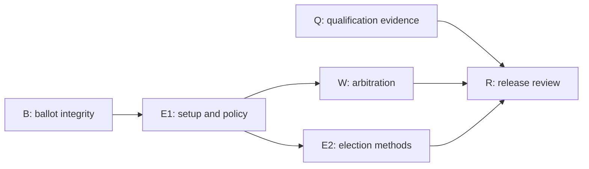

# Daclify Governance Hardening Implementation Plan

> **For agentic workers:** Use `superpowers:executing-plans` to execute the linked work packages in dependency order. No sub-agent delegation is authorized. Keep a durable execution ledger, perform internal reviews and verify each package. Implementation checkpoints do not require repeated user approval. This request prepares the plan; it does not start implementation or authorize deployment.

**Goal:** Make ballot signing reflect the exact decision, give DAOs enforceable arbitration choices, offer several election methods, and qualify the existing wallet and payment journeys.

**Architecture:** Retain the core treasury and identity boundaries, one Decide module, the existing Works module and the existing module activation mechanism. Contracts enforce rules and accounting; producer-owned ABIs and schemas feed the SDK, API and Vue application. Frozen agreements and elections retain their rules when DAO defaults change.

**Tech stack:** Antelope C++, strict TypeScript, Vue 3, Zod, Wharfkit 4.0.2, PostgreSQL, VERT, Spring native fixtures, Vitest and Playwright.

**Date:** 8 October 2026, Canary time. **Status:** Proposed implementation plan. Features and checks below are planned, not completed.

## Outcome and agreed scope

DAOs will be able to choose their modules during setup, enable several election methods and select a method for each election. Works will offer independent-arbiter, DAO-member-vote and administrator arbitration. Every new arbitration-protected agreement includes a pre-agreed backup arbiter; previously funded work retains its original terms.

| Area              | User-established requirement                                                                                                                                                 |
| ----------------- | ---------------------------------------------------------------------------------------------------------------------------------------------------------------------------- |
| Qualification     | Exercise real wallets, Stripe sandbox flows, actual browser origins and recovery. Fixtures alone do not establish live integration.                                          |
| Ballot integrity  | Display actual choices; bind signed votes to frozen content and rules; preserve existing election and funding commitments.                                                   |
| Works arbitration | All three primary arbitration modes are available to the DAO. Select the backup before funding. Keep funds reserved until a valid outcome or mutually authorized settlement. |
| Elections         | Offer single-choice, approval and STV. A DAO can enable several methods and choose one for each new election.                                                                |
| Module selection  | Presets supply defaults; the creator can choose compatible modules to activate, subject to real dependencies.                                                                |
| Compatibility     | Preserve existing records, votes, identities, liabilities and document references. Existing approved obligations retain payment rights.                                      |

Changing the election counter does not grant representatives spending or administrative powers. Voting weight remains separate from counting method: member, governance credit or deposited native stake.

## Proposed defaults for review

The requirements above are agreed. These narrower rules are proposed defaults, not additional decisions attributed to the user:

- Keep one Decide contract with shared nomination, eligibility, commitment, snapshot and term handling.
- Retain the current 15-candidate and 1–8-seat bounds. Approval allows support for any nonempty subset; explicit abstention is separate.
- Start with one STV variant: Scottish-style weighted inclusive Gregory counting, Droop quota and five-decimal integer transfer values. Use earlier-round countback for ties; if a decision-critical tie remains, stop with already awarded seats retained and remaining seats vacant. Do not substitute candidate ID or transaction order for a political tie-break.
- Treat integer credit/stake weight as multiplicity of identical unit ballots for STV. This makes per-unit rounding explicit and supports independently reproducible reference inputs.
- Qualify STV initially for at most 5,000 submitted member ballots. Measure native CPU/NET/RAM before fixing the final supported limit. Never advertise an unmeasured independent-DAO capacity.
- Administrators arbitrate through a majority of the frozen eligible administrator set, with equal weight. DAO-wide arbitration uses the agreement's frozen voting-weight, quorum and decision-threshold rules.
- Exclude the contributor and original reviewer from adjudication. Named primary and backup arbiters are distinct DAO members and cannot review the same protected milestone.
- Propose configurable durations of seven days for initial review, three days for challenge, seven days for primary arbitration and seven days for backup arbitration. Bounds are one hour through 30 days per period. Deadlines and their exact start events are visible before agreement consent.
- Use the protected agreement's term end as its final delivery/revision cutoff. Missing delivery triggers adjudication, not automatic cancellation. Keep this separate from an obligation's earliest payment due time.
- Version one adjudication awards the fixed milestone amount or cancels that unpaid milestone. Ordinary revision requests remain available. Partial awards, fines, arbitration fees and appeal chains are outside this package.

The STV rules are a Daclify rule set, not a claim to reproduce every Scottish statutory tie procedure. The implementation must pin its rule version and compare only against an independent counter configured for matching rules.

## Verified starting point

| Repository              | Version       | Revision inspected                         |
| ----------------------- | ------------- | ------------------------------------------ |
| daclify-backend-core    | 0.7.0-alpha.1 | `9f843904bd8ed68fb0cfbcbd7aac496760935974` |
| daclify-backend-modules | 0.7.0-alpha.1 | `62582331a1c9eea69a3867561527d05e71ce8d35` |
| daclify-frontend        | 0.7.0-alpha.1 | `520b7650493d39e783919a1dc492e8f7fb00c0e6` |

Re-read changed source and worktree status before implementation; these revisions are the planning baseline, not required replacements for newer user work.

Relevant current behavior:

- `contracts/decide/decide.cpp` already freezes election candidates and stores document/policy commitments. Works and Grants execution plans bind exact commitments, code hashes and deadlines.
- The ordinary ballot screen currently renders Reject/Approve regardless of its choice count or metadata labels.
- `runtime::cancelob` currently permits native DAO-owner cancellation of an unapproved obligation. A Works-only dispute feature cannot provide enforceable protection.
- Creation currently installs preset-selected modules; explicit setup selection is absent. Module activation after creation already exists.
- `tools/release/manifest.ts` deliberately keeps publication refused and qualification false. Passing wallet/payment checks does not clear custody, production authority or immutable-publication gates.

## Delivery order

| Package | Deliverable                                                                                                                         | Dependencies                               | Acceptance gate                                                                             |
| ------- | ----------------------------------------------------------------------------------------------------------------------------------- | ------------------------------------------ | ------------------------------------------------------------------------------------------- |
| Q       | [Qualification and evidence](2026-10-08-governance-qualification.md)                                                                | Current application                        | Real checks distinguished from fixtures; missing access remains visibly unresolved          |
| B       | [Ballot presentation and signed commitments](2026-10-08-ballot-integrity.md)                                                        | Owned baseline and generated interfaces    | Tampered content cannot produce an accepted bound vote; old ballots remain interpretable    |
| E1      | [DAO module and policy selection](2026-10-08-election-methods-and-setup.md#task-1-module-selection-and-versioned-dao-configuration) | B                                          | Selected modules are configured on chain; dependencies cannot be bypassed                   |
| W       | [Works arbitration and protected obligations](2026-10-08-works-arbitration.md)                                                      | B, E1                                      | Every arbitration mode, timeout, backup and settlement path preserves backing and authority |
| E2      | [Election methods](2026-10-08-election-methods-and-setup.md#task-2-single-choice-and-approval-elections)                            | B, E1                                      | All three methods have deterministic results, reference checks and native resource evidence |
| R       | Coordinated release and qualification review                                                                                        | Completed affected packages and Q evidence | Exact artifacts, compatibility, documentation and remaining holds are reported honestly     |

Q runs alongside the code packages as provider/client access permits. Code work continues where independent of missing external access. Complete W before spending effort on STV polish if paid Works use is imminent.

## Repository ownership and files

Paths in the linked plans use these prefixes:

- **C:** `daclify-backend-core/`.
- **M:** `daclify-backend-modules/`.
- **F:** `daclify-frontend/`.

| Owner    | Responsibility                                                                                                                                                                        |
| -------- | ------------------------------------------------------------------------------------------------------------------------------------------------------------------------------------- |
| Core     | Treasury protection and settlement authority; shared policy/schema additions; creation validation; dispatch and native permission links; API reads; upgrade and qualification records |
| Modules  | Ballot metadata/commitment definitions and SDK helpers; Decide methods/counting; Works agreement and review lifecycle; Grants integration; generated module ABIs/types and guides     |
| Frontend | Setup selection; ballot review/signing; arbitration and election controls; complete bounded exports; accessible desktop/mobile journeys                                               |
| Operator | Genuine sandbox accounts, wallets, deployed-domain configuration and restore rehearsal; separately authorized deployment                                                              |

Use the source paths in each package and regenerate producer-owned outputs. Do not manually edit `sdk/generated/`, `protocol/generated/` or `docs/generated/`.

## Implementation method

1. Create sibling implementation worktrees for all three repositories using the existing global worktree convention. Preserve active user changes and existing containers.
2. Run source bootstrap and baseline checks against those sibling worktrees. Record exact revisions, artifact pins and any pre-existing failures.
3. Freeze each bounded package's C++ action/table declarations and schema additions before consuming them in SDK/API/UI. Proposed additions in these plans are not existing APIs.
4. Write regressions against the actual WASM/native boundary first; establish the failure, implement the smallest change, then run the affected checks.
5. Follow the producer chain: C++/schema → generated SDK → module API → core API → frontend → tests/fixtures → guides.
6. Commit coherent cross-repository checkpoints and record actual passed, failed, blocked and unrun selections. Continue the agreed work without repeated internal approval stops.

The existing programme [master plan](2026-10-05-daclify-v2-master-plan.md#delivery-management) requires executable code steps after a bounded package's interfaces are verified. These plans specify that work and its acceptance cases; they do not invent a finished SDK or claim that contract algorithms are already implemented.

## Upgrade and compatibility rules

Prefer additive, explicitly versioned tables for ballot commitments, method-specific votes/count progress, DAO policy extensions and protected obligations. Do not append fields to existing serialized rows merely because the ABI generator accepts them.

- Old ballots retain their original counting semantics and legacy signature path. New bound ballots reject the old vote path.
- Preserve existing election nominations, votes, terms and recall records. New counting methods apply to new elections.
- Already funded projects keep their accepted terms. Do not silently introduce payment delays or new arbitrators.
- New protected agreements bind arbitration terms before consent and reservation, including Grants-created Works projects.
- New DAOs using the upgraded Works feature require a protected agreement. Existing DAOs explicitly adopt the new policy for future reservations. Once adopted, legacy action paths cannot create unprotected reservations; old unfunded proposals require updated consent and any necessary fresh funding vote.
- Updating a Works/Grants code hash may invalidate a pending funding execution plan. Preserve its original pin, show why execution is unavailable and require fresh authorization under the new code. Never rewrite a voted code hash to make execution pass.
- DAO policy/default changes affect future agreements/elections. Disabling modules or hosted subscriptions never cancels approved liabilities.
- Preserve metadata schema 1–3 readers. Introduce a new version for new setup provenance rather than changing old stored-schema meaning.
- Add PostgreSQL migrations only for genuinely required persisted service data. Re-read the highest migration number at implementation time; applied migration bytes remain immutable.
- Choose the coordinated prerelease version after checking active development. Keep base interface 1 only if actual serialized compatibility checks support that choice; otherwise version and migrate explicitly.
- Build the 0.7 upgrade fixture from the pinned revisions above in addition to retaining older supported fixtures. The current `tools/build/upgrade.ts` fixture predates 0.7 and cannot prove this upgrade by itself.

## Verification and release review

From the appropriate sibling worktree, the existing commands are:

| Repository | Checks                                                                                    |
| ---------- | ----------------------------------------------------------------------------------------- |
| Core       | `npm run verify`, `npm run build`, `npm run format:check`, `npm run test:integration`     |
| Modules    | `npm run verify`, `npm run build`, `npm run format:check`                                 |
| Frontend   | `npm run verify`, `npm run build`, `npm run format:check`                                 |
| Native     | Existing research and paid native selections plus new owned governance/upgrade selections |
| Browser    | Existing paid/research/payment selections plus the new governance selection               |

Provider/client checks are additional. A command's presence in this table is not a passing result.

Rebuild actual contracts, generate ABIs/SDKs/docs, package development artifacts and reinstall consumers through the existing bootstrap. Keep publication refusal in place while unrelated release holds remain. Generate a review packet with commits, WASM/binary-ABI/document hashes, migration and authority changes, actual commands/results, compatibility outcomes, resource limits and public limitations.

No production deployment, authority change, key rotation, live charge, asset movement or cutover is authorized by this plan. Prepare reviewable tooling and permission diffs; those operations follow completed-code review and express authorization.

## Definition of done

Each package is complete when its contract rules, producer types, API/UI integration, fixtures, regression/native checks and product documentation satisfy its acceptance gate. A coded but unqualified capability remains visibly unavailable in that environment.

The overall delivery must demonstrate:

- Exact ballot content/options/rules bound to the accepted signature.
- Explicit module/method selection with authoritative dependency enforcement.
- Three arbitration modes, a pre-agreed backup and protected reserved funds.
- Single-choice, approval and STV with honest tie and counting behavior.
- Preserved approved obligations, old records and recovery rights across upgrade.
- Reproducible results, once-only settlement, DAO isolation and complete typed exports.
- Actual external qualification evidence, or specifically identified outstanding checks.

There is no calendar estimate yet. STV resource measurements, external provider access and domain/client qualification determine the uncertainty; commit counts do not establish delivery time.

## Sources and limits

Local source and the programme's canonical [architecture](../specs/2026-10-05-daclify-v2-architecture.md), [work packages](2026-10-05-daclify-v2-work-packages.md) and [release policy](2026-10-05-daclify-v2-release-docs-test-policy.md) govern implementation.

[Wharfkit migration notes](https://wharfkit.com/docs/releases/4-0-1) retain the package names across the monorepo move. [Loomio's STV guide](https://github.com/loomio/loomio/blob/d4c0200735df5a459ba905b48dec4d25e82ed04e/docs/en/user_manual/polls/stv/index.md) describes Scottish-style transfer rounding and countback. [ConcreteSTV](https://github.com/AndrewConway/ConcreteSTV) illustrates why a reference comparison must match the counting rule set. These are design/test references; no third-party implementation code is proposed for copying.
