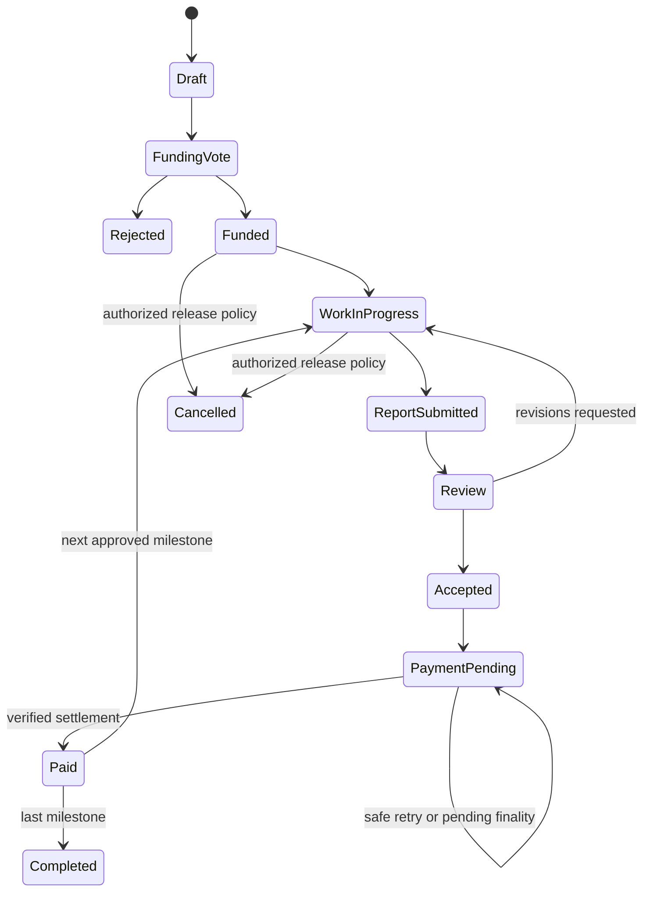

# Daclify V2 Architecture and Product Specification

Date: 2026-10-05. Status: proposed architecture for the comprehensive rebuild. User-established requirements are identified in the [master plan](../plans/2026-10-05-daclify-v2-master-plan.md); defaults below are recommendations unless explicitly recorded as selected. No V2 implementation or deployment is implied.

## Product objective

Daclify should let a community create a DAO, admit members, define governance, approve and execute work, manage assets, and share documents without requiring every member to create a blockchain account. Experienced DAOs can own and operate their contracts while retaining compatibility with the application and discovery Hub.

Telos Zero hosts the first authoritative contracts. EVM wallets are an authentication option, and EVM assets and payouts use explicit adapters. Other chains can supply account credentials, voting-weight evidence, or payment settlement evidence through separate capabilities. Supporting one capability does not imply support for the others.

## Proposed code and deployment layout

The repository split is selected: frontend, backend core services, and backend modules. The three repositories below have been created privately and cloned alongside the unchanged legacy inputs. Their implementation directory layout is a target; only repository setup and planning documentation exist so far.

```text
daclify-frontend/
  src/app/                         Vue/Vite bootstrap, router and layouts
  src/components/                  Accessible first-party UI components and styles
  src/features/                    DAO, module, custody and wallet screens
  src/auth/                        Client vault, signing and recovery
  src/content/                     Client encryption and content rendering
  src/features/help/               Version-aware contextual help and searchable guides
  src/sdk/                         Consumers of pinned generated SDK/schema artifacts
  tests/{unit,e2e}/                UI and complete browser/Telegram journeys
  {package.json,package-lock.json,vite.config.ts,tsconfig.json}

daclify-backend-core/
  services/api/                    Authentication, custody, typed API and content services
  services/worker/                 Relayer, durable worker host and reconciliation
  protocol/schemas/                Common runtime schemas and module host interfaces
  sdk/generated/                   Core ABI-generated public SDK/types
  sdk/public/                      Safe shared encoding, CID/envelope and client helpers
  contracts/common/include/        Canonical C++ records and checked utilities
  contracts/hub/                   Discovery and verified deployment references
  contracts/runtime/               DAO, identity, roles, capabilities and executor
  contracts/governance/            Credits, staking and checkpoint primitives
  contracts/finance/               Treasury, obligations and native settlement
  migrations/                     Core database schema and registered module migration host
  tests/{contracts,integration}/   Core VERT/native/API/worker compatibility tests
  tools/{codegen,build,deploy,migration}/
  tools/docs/                      Schema/ABI reference and release-doc bundle generation
  docs/                            Core protocol, operation, security and migration references
  {package.json,package-lock.json,tsconfig.json}

daclify-backend-modules/
  modules/decide/                   Ballots, result consumption and election integration
  modules/works/                    Grants, milestones and acceptance
  modules/payroll/                  Recurrence and due-payment jobs
  modules/telos-evm/               EVM weights, vaults and settlement
  modules/external/                Named additional-chain verifiers/adapters
  catalog/                         Versioned manifests, schemas and configuration presets
  tests/compatibility/             Supported core/module combination tests
  tools/{codegen,build,deploy}/     Module ABI/types/artifact generation and deployment
  docs/                            Module behavior, trust, migration and configuration
  {package.json,package-lock.json,tsconfig.json}
```

Use independent repository manifests, lockfiles, CI and release histories. Core publishes versioned public protocol/SDK artifacts; modules publish their own manifest/config/ABI-generated artifacts and consume a pinned core protocol. Frontend consumes both producers' public artifacts. Select a package/artifact registry at repository setup, with immutable version/hash verification and no access to backend secrets. Temporary local package overrides are development-only.

CI validates producer code generation and consumer compatibility. A tested release manifest pins frontend/core/module/protocol/SDK and deployed code/ABI versions. Support compatible older consumers during rolling releases; breaking changes require explicit interface versions, migration and a coordinated rollout. Cross-repository changes are separate reviewable changes linked by the release manifest, not assumed atomic commits.

Apply the [version/documentation/test policy](../plans/2026-10-05-daclify-v2-release-docs-test-policy.md). Code/package SemVer, persisted data/interface versions and exact tested release manifests have separate jobs. Include documentation bundle hashes and supported old-version readers. Versioned signatures/configuration/encryption envelopes need canonical schema identifiers; incompatible state upgrades use authorized resumable migrations and preserve votes, identity, backing, liabilities and key references. Do not infer serialization compatibility from a source tag or ABI diff alone.

Module backend handlers/jobs can run in the core host as versioned plugins. They consume only published host capabilities and register owned database migrations; they do not import private core database/auth code or receive unrestricted database/signing access. Apply migrations through the core deployment coordinator, record their namespace/version, and verify compatibility before enabling a module. Separate process deployment is a security/operating choice, not an automatic consequence of repository separation.

The frontend owns reviewed UI code for module screens. Schemas/presets can come from module releases, but the catalogue cannot load arbitrary remote executable components. Public shared cryptographic encoding/CID/envelope helpers can be distributed from core's SDK without exposing private custody implementations. Contract builds run in a pinned toolchain environment; production never uses the currently installed development CDT merely because it happens to be present.

The proposed physical contract split keeps authorization and upgrade boundaries understandable. Confirm cross-contract cost and permission behavior in P1; combine logical modules within an existing boundary where that reduces deployment cost without granting unnecessary authority.

## Authoritative state and type ownership

- C++ structures and action declarations define authoritative contract state and the generated ABI.
- ABI generation produces SDK action/table types. Checked-in generated output includes its generator version and ABI hash; regeneration must produce a clean diff for unchanged source.
- Canonical runtime schemas define API requests, module configuration, metadata JSON, and external evidence envelopes. Infer TypeScript types from those schemas.
- Core owns the common protocol/API records; module producers own their module configuration and action records. Consumers use pinned generated releases and compatibility checks instead of copied model definitions.
- Distinguish transport data, validated domain values, and generated contract values. A boundary adapter is the only place that converts between them.
- Use integer base units for money and credits. Native `asset`/`extended_asset` limits and EVM `uint256` limits require checked conversion; values that cannot be represented are rejected explicitly.
- API and browser code treats RPC/IPFS/provider responses as untrusted `unknown` until validated. Neither browser state nor an indexer's projection can authorize spending.
- Contracts validate input, membership, capability, state transition, and accounting invariants. The API applies authentication, rate/entitlement limits, and consistent errors but cannot override contract policy.
- Public errors have stable codes and useful context. Detailed provider/internal errors are logged with redaction and correlation identifiers; secrets and private content are excluded.

## Stable identifiers

These are conceptual records to be finalized in generated ABI/runtime schemas, not invented current APIs.

| Record | Required identity and data |
| --- | --- |
| Deployment reference | Native chain ID, runtime contract account, interface version, module contract references, upgrade authority description, supported capabilities. |
| DAO reference | Deployment reference plus DAO ID. A human slug or title is a label and never an authority identifier. |
| Member reference | Identity issuer/deployment plus internal member ID. DAO membership references it explicitly. |
| Linked account | Chain namespace and chain ID, address/account, credential kind, proof-of-control binding, permitted scopes, custody mode, status and replacement history. |
| Asset reference | Chain ID, token contract/address, token identifier or native symbol/precision, validated decimal metadata, adapter version. |
| Governance-credit reference | DAO reference plus credit-class ID and precision; cannot be confused with an externally spendable asset. |
| Module reference | Stable module ID, interface/config version, deployment target, bounded granted capabilities, configuration revision. |
| Payment obligation | DAO, obligation ID, originating proposal/milestone/payroll, payer treasury/vault, recipient account reference, asset, exact amount, due/expiry policy, settlement adapter and verifier policy. |
| Document reference | DAO, document ID/version, metadata schema, on-chain JSON/ciphertext or IPFS CID, content commitment, encryption envelope version and key epoch. |

Nested scopes are not access controls. Every action validates the complete DAO/deployment context, including secondary-index results and callback identities. Shared contracts must not treat a proposal-local integer or a token ticker as globally unique.

## Deployment modes and ownership

### Shared platform deployment

Many DAOs occupy a runtime, governance, and finance deployment. All records, obligations, credits, keys, and module grants are explicitly DAO-scoped. Native assets may be pooled in a contract account, but each DAO's ledger and liabilities are isolated and the aggregate backing reconciles against real contract balances. Resource charges and quotas are accounted per DAO.

Shared EVM deployments should use a separate vault per DAO where compatible contracts make that feasible; a single native-to-EVM account mapping must not silently turn all DAOs into one unsegregated EVM treasury. The supported vault design is decided after checking mapping and call behavior. Shared upgrade authority remains a platform-wide risk even with correct table scopes.

### Independent DAO deployment

A DAO controls its contract accounts, permissions, deployed modules, upgrade policy, treasury, content services, and compatible relayer configuration. It can register with the Hub and connect by a direct deployment reference. Core operation must not require a Hub operator, hosted entitlement server, or platform maintainer to approve actions.

Managed accounts can be supported on independent deployments, but their dependency on a managed provider is explicit. The DAO can require user-controlled custody and self-host the remaining services. Internal member IDs are not regenerated during deployment migration; preserve issuer identity or use a signed migration binding verified by both source and destination policy.

### Hub registration and discovery

The Hub records verifiable deployment ownership, chain/contract references, compatible interface versions, enabled public capabilities, and public display metadata. Require deployment-owner authorization when adding or replacing contract references. A compatibility claim is labelled until the conformance suite and deployed artifacts verify it; it is not a security certification.

Unlisted private DAOs may omit public branding and directory inclusion. They cannot promise that chain observers cannot discover their accounts, transactions, sizes, or membership-related activity. Hub downtime must not stop voting or fund access.

### Upgrade policy

Module configuration changes use DAO authorization and versioned revisions. Active ballots and payment obligations pin the rules necessary to interpret them. Upgrade handlers must preserve accounting and migration invariants. An incompatible schema upgrade requires an explicit migration action and read compatibility window.

Document native owner/active/code permission graphs, upgrade signers, delays, recovery authorities, and platform powers. Grant modules narrow permissions. Review an actual native permission graph; an application label such as "DAO controlled" is insufficient. Paid modules and relayers receive no implicit owner authority.

## Identity, account custody, and authentication

### Member identity and wallet binding

All entry paths resolve to the same member identity. One member can link multiple supported credentials without receiving extra membership seats or member-based voting weight. Admission policy still determines whether different identities represent different people; social login and wallet ownership do not provide Sybil resistance.

Binding requires a challenge that includes the member, chain/account, deployment domain, intended link scope, nonce, and expiry, plus authorization by the existing identity and the incoming credential as applicable. Prevent replacement through email matching, wallet UI state, or recycled Telegram/usernames. Recovery and wallet replacement are explicit state transitions with audit events.

For independent deployments, external identity providers or shared identity issuers are configured trust dependencies rather than mandatory platform privileges. DAO owners can select a compatible self-hosted issuer or user-controlled credentials.

### User-controlled mode

Signing keys and decryption keys are generated and controlled by the user, with separate purposes. Recovery uses an encrypted recovery credential or another user-controlled mechanism verified in the feasibility prototype. Daclify cannot reconstruct those keys using a successful social login alone. Store no plaintext secret keys in browser LocalStorage, ordinary account exports, analytics, or application logs.

Passkeys are an unlocking/authentication option only after WebAuthn, supported curves, signing-envelope verification, PRF/vault unlocking, browser support, and Telegram webview behavior have been demonstrated. They are not assumed to be interchangeable with Boid's K1 signatures. A secure fallback is part of the release, including its backup and recovery UX.

### Managed mode

The selected service controls recoverable signing/decryption keys under an explicit customer agreement and technical custody policy. The UI explains that service-assisted recovery is possible and that the operator/provider can access managed decryption keys. Encrypt keys at rest using a dedicated key-management boundary; isolate application database access from signing/decryption authority. Record privileged operations and recovery events with redacted logs.

Managed governance signing requires authenticated user intent, current contract permission, scoped action policy, freshness, idempotency, and step-up protection for sensitive actions. A backend operator must not obtain broad DAO authority merely because the service holds a member key. Nevertheless, managed key control permits impersonation within that member's authority; document that residual trust rather than claiming cryptographic prevention.

Support a custody-mode transition with new keys, proof of possession, revocation of old credentials, and rewrapping of content keys. Managed recovery/export and the orderly exit path remain available after subscription expiry under published retention terms. Key-management provider limits and costs are measured before promising free managed accounts at unlimited scale.

### Social and Telegram entry

Use validated OIDC identity with the provider's stable subject ID; verify signature, issuer, audience, expiry, nonce/state, and redirect policy. Account linkage needs current user intent and existing-account authorization, not equality of email strings.

Telegram Mini App authentication validates raw `initData` on the server using the official signature/HMAC procedure and a freshness/replay policy. Do not authorize from `initDataUnsafe`, browser-supplied Telegram profile objects, bot chat membership, or a Telegram handle. Separate Telegram login, bot commands, and notification delivery. The bot can submit permitted requests; it cannot manufacture ballot approvals or payment acceptance. [Telegram validation reference](https://core.telegram.org/bots/webapps#validating-data-received-via-the-mini-app)

### Native and EVM authorization

Native actions use verified account/permission authorization. Internal signed instructions use a domain-separated canonical encoding that binds chain, deployment, member, DAO, action data, signature version, nonce, and expiry. Avoid Boid's small wrapping nonce and omission of the account from the signed payload.

EOA EVM instructions use an audited EIP-712 encoding with the same application-level replay and target protections. Relayers provide liveness and resources, not voting authority. Signing a valid instruction must not permit its reuse on another DAO, contract deployment, chain, or module.

EVM contract wallets use a supported contract-validation path, such as ERC-1271 with authenticated runtime execution/state evidence. EOA recovery must never be applied to a contract-wallet address as a substitute. Account capability discovery explicitly labels unsupported wallet types. [EIP-712](https://eips.ethereum.org/EIPS/eip-712), [ERC-1271](https://eips.ethereum.org/EIPS/eip-1271)

## Module configuration and authority

Each first-party module manifest declares identity, version, ABI/config schema references, dependencies, allowed deployment modes, account/asset capabilities, requested authority, resource limits, state migration compatibility, and optional hosted-service entitlement requirements. The application renders typed first-party configuration components. Do not execute unreviewed remote Vue/JavaScript from Hub metadata or a paid module catalogue.

Enabling a module is an authorized DAO configuration change. The contract verifies its version, dependencies, target accounts, allowed callbacks, and requested grants. Grants are explicit, revocable, and bounded by DAO, action, asset, amount/time limits where appropriate. Unlinking a module does not erase unpaid obligations or undecryptable historical documents.

Provide presets for member voting, governance credits, native-token voting, committee administration, milestone grants, payroll, and private projects. Show understandable choices first and advanced configuration separately. Before saving, present changed authority, new custody dependence, charges/resource allowance, and obligations affected. These details help the administrator make a meaningful decision.

## Internal credits and token governance

The internal credit ledger supports class definition, integer precision, capped or governed issuance, grant/burn policy, optional expiry if the DAO selected it, checkpoints, and an audit history. Credits are scoped to one DAO. Default transfers are disabled. Supply and member balances reconcile; a credit balance is never counted as treasury backing or withdrawable money.

Native token voting initially uses a supported staking adapter with a clear lock policy or authenticated checkpoint history. Reading only a member's current liquid balance at vote time cannot prevent transfer-and-revote. Ballot opening pins eligibility and the weight evaluation policy; subsequent minting, recovery, wallet linking, staking changes, and membership removal follow explicit active-ballot rules.

EVM/ERC-20 weight providers require supported token identity and authenticated checkpoint/locking evidence. Native C++ access to current EVM storage does not supply historic balances automatically. Declaring ERC-20 compatibility is insufficient: upgradeable, rebasing, fee-on-transfer, bridged, and checkpoint-less tokens require an explicit supported policy or rejection.

For a bridged token, choose a canonical weight source or a combined source with demonstrated no-double-counting. The UI identifies eligible assets and evaluation time. Do not sum the same locked native backing and its EVM representation.

## Decide governance module

First-release ballots support a member/credit/native-token weight source; yes/no/abstain proposals; single-choice and bounded approval elections; explicit option limits; quorum and approval ratios; optional vote replacement; start/end times; cancellation rules; and immutable finalized results. Committee seats and proposal execution consume those results through authenticated interfaces.

Use bounded integer ratios, exact denominator definitions, explicit tie behavior, and minimum non-abstaining support. Quorum policy identifies whether abstention counts. At opening, pin option content commitments, policy version, executor target/actions, eligibility, and weight policy. Large descriptive content is referenced by CID/commitment rather than made mutable during voting.

A ballot can be finalized by a permitted keeper after its end; proposer disappearance must not trap finalization. Keepers cannot invent votes or change results. Finalization does not depend on a receiver callback that can reject indefinitely: use a durable finalized result and separately retryable, authorized consumption wherever cross-contract mechanics permit. Record whether the result was executed.

An executor validates the entire proposed action set, current membership/authority policy, result authenticity, execution deadline, pinned constraints, and single execution. It rejects unknown action types, unexpected recipients, unapproved permission levels, and stale/revoked capabilities. Governance can tighten or revoke dangerous pending operations through an explicit policy; it must not silently relax a pinned approval requirement.

Avoid old Decide light-ballot publisher totals for fund-controlling decisions. Secret ballots, ranked voting, delegation, and quadratic voting are separate extensions with their own admission and verification specifications.

## Treasury, Works, and payroll

### Treasury ledger

For every supported asset, distinguish actual backing, spendable DAO balance, reserved commitments, member/depositor liabilities, and settled outflows. Account for platform fees separately. Aggregate liabilities cannot exceed backing under the supported adapter's accounting model. Shared deposits require the correct token contract, symbol/precision, sender, recipient, and validated DAO deposit reference; unsolicited/unsupported transfers have an explicit return or recovery policy.

Zero/native payment uses actual contract transfer execution and correct inline authority. A walletless beneficiary can receive an internal claim against backing, or choose a verified supported external destination; governance credits are never the payment balance. Manual withdrawals remain authorized and available regardless of hosted automation subscription.

### Works state machine



Specify grant-level versus milestone-level funding votes, designated reviewer/committee or DAO acceptance, report commitments, requested amounts, deadlines, revision/dispute windows, and cancellation rules. A nonempty report is insufficient for payment. An optional advance is an explicit authorized payment type; do not disguise an advance as proof of completed work.

Reserve either the full grant or the current milestone according to a selected policy. Under milestone-only reservation, future funding is not guaranteed and the UI must say so. Allocation totals exactly equal the approved grant; assign any division remainder explicitly. Refundable anti-spam bonds are optional and separate from Daclify subscription billing. A 5% entry fee is not adopted as the default.

Approval creates a uniquely identified payment obligation. Paid status requires adapter-verified settlement. Cancellation cannot reverse already-settled transfers and cannot discard accepted payable liabilities. Disputes use a documented DAO authority; arbitrary operator arbitration is not assumed.

### Payroll

Support one-off payments and bounded recurrence with explicit remaining count, period, due date, amount, recipient, funding source, and cancellation authority. Reject zero counts, invalid periods, overflow, insufficient unreserved funds, and invalid recipients. A late worker never pays multiple missed periods accidentally; the configured catch-up policy is frozen on schedule creation.

Keepers and hosted schedulers call a permissioned, idempotent due-payment action. Turning off hosted automation affects submission convenience, not entitlement to approved payments. Governance can cancel future cancellable periods without marking accrued liabilities paid.

## Telos EVM and other-chain adapters

Separate account authentication, governance weights, asset transport, payment execution, and settlement verification. An adapter advertises exactly the capabilities implemented and tested.

The reviewed Boid bridge reads `eosio.evm` account storage from native C++ and submits EVM transactions with `raw`. A read-only mainnet check on 2026-10-05 found those ABI surfaces on two endpoints. This supports a Telos-specific prototype, not a guarantee of arbitrary synchronous calls, atomic rollback across runtimes, successful receiver execution, or bridge safety. Test those properties with the selected deployed runtime. [Boid source](https://github.com/animuslabs/boid-token-evm/blob/main/antelope-compile/src/tokenBridge.cpp)

Prefer a supported EVM vault/adapter contract that records explicit durable obligation IDs and settlement states. If native verification reads EVM storage, pin the supported address, code/schema version, storage layout, and upgrade policy. Absence of a request is not a general proof of successful payment; refunds, admin deletion, failed calls, and pruning must remain distinguishable. An indexer discovers work but supplies no unauthenticated settlement authority.

For external chains, define DAO-confirmed, attested, and contract-verified policies as distinct modes. DAO-confirmed evidence is an authorized statement; an attestation trusts its configured signer set; contract verification needs authenticated chain state/finality and a validated inclusion/state proof. Do not describe RPC receipt lookup as trustless proof.

Every settlement binds the chain, payer/vault, recipient, exact asset/amount, obligation ID, successful execution, finality policy, event or state identity, and verifier version. Duplicate transaction/event evidence cannot pay multiple obligations. Reorgs, failed/replaced transactions, bridge-source success with destination failure, refunds, and partial payments have explicit statuses and reconciliation rules.

Use asynchronous obligation states: authorized, submitted, pending verification/finality, settled, failed-retryable, disputed, and cancelled where allowed. Retry checks the existing destination-chain state before sending again. Maintain replay protection after cleanup using persistent consumed IDs, monotonic sequences, or a validated accumulator design. Display the actual verification mode and delay in the UI.

## Content, IPFS, and confidentiality

### Durable public content

Small descriptive metadata uses bounded schema-versioned JSON. Governance rules, balances, module grants, and payment obligations remain typed tables. Proposed initial metadata maximum is 4 KiB per document record, subject to RAM measurements in P0; contract limits and UI limits must agree.

Larger documents/files use canonical validated IPFS CIDs plus content format/version/size and a commitment. Pinata is the selected initial provider. Core owns backend-only credentials, authorized quota-bounded upload tickets and pin/retrieval jobs; frontend uploads already-encrypted private bytes through constrained signed URLs where the verified provider behavior supports them. Validate completed ownership, size, CID and reconstructed-byte integrity before publishing an authoritative record, then monitor retrieval/pin health. Keep portable CIDs in the contract and provider IDs in service state. Store immutable document versions and a current-version pointer. Do not use transaction/block history as the sole content store. [Pinata upload reference](https://docs.pinata.cloud/files/uploading-files)

Private content uses member-held encryption over ciphertext pinned on public IPFS. Pinata Private IPFS access links are a separate provider network/service and do not replace cryptographic confidentiality. Export/re-pinning, retention, failure/retry and orphan cleanup follow the companion policy. Independent deployments can supply their own Pinata configuration or compatible content service. Provider limits, signed-URL replay behavior and live retrieval remain integration gates. [Pinata network reference](https://docs.pinata.cloud/files/private-ipfs)

Deletion changes current availability/visibility and removes agreed pins where allowed. It cannot erase public blockchain history, remove copies held by others, or guarantee disappearance from IPFS. [IPFS privacy reference](https://docs.ipfs.tech/concepts/privacy-and-encryption/)

### Private content

Encrypt in the client before chain/IPFS submission. Use a vetted authenticated-encryption construction, a fresh random content key per document/version, and explicit algorithm/envelope identifiers. Separate signing keys, member encryption keys, and DAO key epochs. Wrap content keys under the permitted DAO epoch scheme; grant epoch keys to eligible member encryption keys through authenticated membership operations. Verify the prototype's exact algorithm and key-wrap compatibility before fixing the wire format.

Store ciphertext and necessary public commitments/envelope references only. Avoid plaintext titles, descriptions, member contact details, filenames, analytics, search records, notification messages, and logs that defeat the selected privacy policy. Encrypted DAOs initially support client-side private-content search; an operator-readable server index is a different disclosed product mode.

DAO privacy presets:

| Preset | Content access | Allowed custody |
| --- | --- | --- |
| Public | Public descriptive content. | User-controlled or managed. |
| Encrypted member content with managed custody allowed | Eligible members plus services controlling those members' recoverable decryption keys. | Both, explicitly disclosed. |
| Encrypted member content with user-controlled keys required | Eligible member key holders; platform holds no recoverable content keys. | User-controlled decryption only. Managed signing alone may be supported only if the encryption-key boundary remains demonstrably user-controlled. |

Admission requires the chosen key-custody capability. A managed member is not silently admitted into an operator-excluding content policy. New member historic access and revoked member future access are separate policies. Rotation limits future access; historic keys/plaintext already disclosed remain disclosed. Social recovery does not recover lost user-controlled decryption keys. DAO-selected recovery trustees are an explicit additional key-holder policy, not an invisible default.

An existing authorized client grants keys to a new member. A blind backend cannot create a new decryption grant without the necessary keys. Plan for the operational case where no authorized member client is online, and avoid advertising immediate onboarding into private content then.

Encryption protects content, not transaction graphs or contract-visible values. Contracts cannot evaluate arbitrary encrypted proposal conditions or verify a private deliverable's quality. Authorized human acceptance can commit an outcome without exposing the document body.

User-controlled encryption removes routine backend key custody. It still assumes a trustworthy client: malicious frontend updates, compromised devices and authorized members retaining/sharing plaintext defeat broader secrecy claims. Provide reviewed static/self-hosted client artifacts and document this boundary; do not promise operator exclusion against arbitrary client-code replacement.

## Frontend and hosted service behavior

Build the frontend with Vue 3 Composition API, Vite, Vue Router, Pinia and strict TypeScript, without Quasar. Use a small consistent accessible component/style layer; select any headless component dependency through WP13's UI requirements rather than replacing Quasar with another mandatory full framework. Migrate useful visual assets and workflows after validation; replace UAL/Scatter and the broken dynamic component-loader approach. Pinned generated SDK clients support Hub discovery and direct deployment connection. Run `vue-tsc` as an explicit CI check because Vite transpilation does not type-check Vue/TypeScript. [Vue TypeScript reference](https://vuejs.org/guide/typescript/overview.html)

Required screens: custody-aware onboarding and recovery; DAO creation/deployment choice; membership and roles; governance-credit/token setup; ballots and proposal execution; treasury and payment status; Works milestones/reports/reviews; payroll; public/private documents; module configuration; subscription/resources; independent deployment connection; migration reports; and permission/upgrade summaries.

Documentation is part of those workflows. Core/module producers generate reference bundles from canonical schemas, compiled ABIs and manifests; feature owners write guides covering roles, decisions, limits and recovery. Frontend provides contextual field/action help, a searchable accessible help centre, matching release notes and DAO/module upgrade guidance. Stable topic IDs resolve against the connected deployment's versions; older supported deployments retain their matching guides. Docs/examples/link resolution, sanitized rendering and help/version interactions have CI and browser acceptance checks. Generation does not replace explanatory writing.

Provide accessible keyboard navigation, labelled controls, valid progress/toggle semantics, visible focus, sufficient contrast, enabled zoom, mobile layouts, localization-ready text, and clear pending/error/retry states. Financial and ballot displays cannot show `NaN`, negative impossible balances, or unsupported "paid" statuses. Test with actual supported Telegram webviews, not only a desktop browser at a narrow width.

The backend core repository owns the modular TypeScript API, worker host and custody boundary. The backend modules repository supplies enabled module handlers/jobs through published host interfaces. Persistent off-chain state includes provider links/sessions, custody metadata, entitlements, pin jobs, work leases, and reconciliation state. Use PostgreSQL with migrations, constraints, indexes, and transactional idempotency for these records. Keep private content and secret keys outside ordinary application tables. Add caching, queues, or Redis only after measurements show a need.

Distinguish Telos endpoint types in validated core configuration: the service API at `https://api.telos.net` uses the supplied [Swagger documentation](https://api.telos.net/v1/docs/index.html) and its discovered [OpenAPI schema](https://api.telos.net/v1/docs/json); native-chain RPC provides the verified `/v1/chain` interface; EVM RPC provides JSON-RPC. The service schema documents account services, statistics, token supply, contract metadata and testnet tools. Read-only native `get_info`/`get_abi` requests to that service base returned 404 during this revision. Choose and health-check each endpoint type for its advertised interface; do not derive an EVM/native RPC URL from a service API label or call account-creation/faucet routes during read-only checks.

Jobs survive restart with durable idempotency and retry state. Do not depend on an in-process interval for financial liveness. Service downtime leaves manual compatible submission available, except for the explicitly disclosed dependence of managed signing/recovery on its provider.

## Commercial boundaries

Subscriptions and entitlement state are independent from DAO permissions. Paid service checks occur at the authoritative service/contract boundary where applicable; a hidden UI button is insufficient. Purchase or expiry cannot increase voting weight, grant admin powers, revoke decryption rights, prevent export, block withdrawals, or label an unsettled payment settled.

Resource quotas cover RAM, relaying, pinning, retrieval, managed signing/recovery, and automation. Expiry stops new premium work and applies a published retention/grace period with export instructions. Basic manual execution and managed custody exit follow the documented availability policy. Independent DAOs can use alternative compatible services.

## Acceptance evidence

Conformance tests cover both deployment modes and every advertised capability. Contract test fixtures are synchronously initialized from compiled C++ WASM/ABI. VERT tests exercise state and authorization supported by that emulator; native-chain tests exercise real permission graphs and missing intrinsics. No mocked proof verifier is described as proof verification. [VERT project](https://github.com/XPRNetwork/vert)

Require adversarial tests for cross-DAO scope/index confusion; key/wallet-link takeover; wrong deployment/chain/action replay; nonce wrap and concurrency; recovery revocation; duplicate identity weight; mint/stake/checkpoint changes during voting; threshold/precision/overflow boundaries; forged notifications and callbacks; balance/commitment conservation; double settlement; payment retry/reorg/refund; malformed CIDs/envelopes; key rotation/history grants; unmanaged content leaks; invalid manifests; billing expiry; and migration gaps.

Extend this with reproducible property/state-machine and fuzz tests, targeted mutation checks of critical guards, actual provider sandbox checks, concurrent worker/database fault cases, supported-release migration fixtures and version-matched UI documentation journeys. Maintain a requirement-to-test register and report real runtime/provider/client checks separately from mocks or skipped checks. Required suites fail when absent; a large test count is not a substitute for invariant coverage.

The work-package plan assigns each boundary its acceptance criteria and output files. Release readiness requires evidence for complete journeys and actual authorities, not only successful compilation or a visually functional demo.
