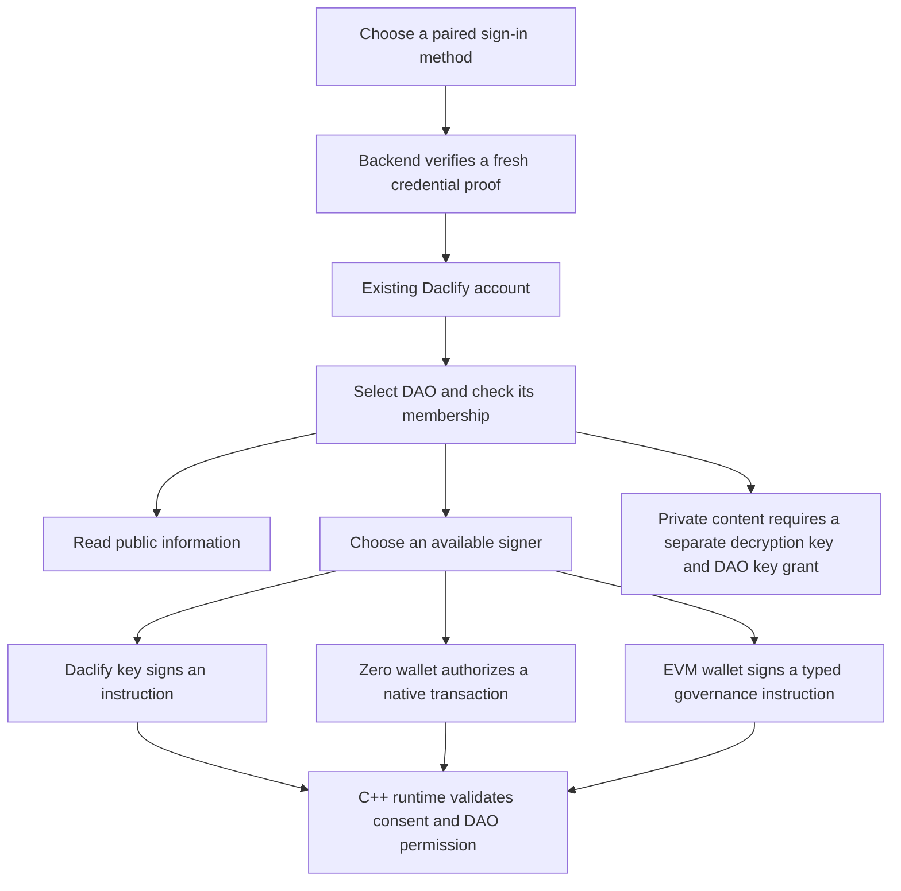

# Paired login and direct wallet governance

Date: 2026-10-07. Status: implementation design; no new login or contract capability has been implemented by this document.

The user selected **direct governance authorization from linked blockchain wallets**, alongside Telegram and email login. Both user-controlled and managed account modes remain required. Managed production custody remains unqualified; that existing limitation is not resolved by adding login buttons.

## Product behavior

A person has one Daclify account at the configured service, with separate memberships and permissions in each DAO. Telegram, email, a Telos Zero account and a Telos EVM address can be paired to that account. Returning users choose whichever paired method is convenient. An unpaired credential does not silently create or merge accounts, enrol a member, issue credits or acquire a treasury destination.

The login screen presents **Telegram**, **Email**, **Telos Zero wallet**, and **Telos EVM wallet**, plus existing passkey and recovery options. Availability comes from the backend's verified configuration and deployment capabilities. Show an explanation when a method is unavailable. The ordinary returning-user journey must not begin with a recovery-kit upload or a demand to unlock the vault.

For a first account, explain the two custody modes and generate the necessary keys within onboarding. User-controlled mode still needs an encrypted local vault and a recovery kit. The choice of a social login does not remove that responsibility. A managed onboarding option becomes usable only after its provider and recovery path pass the existing custody gate.

This is account login followed by DAO access, rather than a separate password system per DAO. Opening a service session, becoming a DAO member, signing an action and decrypting a document remain distinct decisions.

## Verified starting point

Baseline commits: core `933f57e98335bac39bd51765ac6fa19a889c6128`, modules `3a06bea4bc852871cbc5fafcce2e0db7ebbfb1ea`, frontend `92e81452c6f6562a7630bffd5a57a8d0e2847b4a`. Packages are `0.4.0-alpha.1`; the existing native instruction/interface version is 1.

| Method | Current implementation | Required addition |
| --- | --- | --- |
| Daclify key | `src/auth/session.ts` unlocks the local encrypted vault, proves key possession and signs native instructions. | Keep this path and make signing choice independent of vault availability. |
| Email | Backend pairing/login routes and frontend code-entry flow exist. Login requires an actual delivery adapter; local pairing can reveal a development code. | Production mail delivery, generic discovery responses and the complete paired-login journey. |
| Telegram | Widget pairing/login and server validation of widget/Mini App proofs exist. Live bot configuration and real-client evidence are absent. | Modern web login, Mini App entry integration, challenge-bound pairing and real-client tests. |
| Passkey | Authentication exists; it does not decrypt the local vault. | Preserve that distinction; PRF unlocking is a separate verified enhancement. |
| Telos Zero | Runtime `linknative` requires member authorization and incoming native authorization; `submitnat` uses the linked native account. | Wallet integration, backend proof verification, explicit service pairing and direct action UX. |
| Telos EVM | Backend `evm_links`, browser pairing and EOA signature recovery exist. The signed linking text is custom; no EVM login route or C++ EVM authorization exists. | Standard login challenge, stronger pairing, on-chain binding and typed direct governance verification. |

Relevant sources: frontend `src/views/Account.vue`, `src/components/SignInMethods.vue`, `src/components/LinkedAccounts.vue`, `src/auth/session.ts`; core `services/api/src/auth/`, `services/api/src/providers/proofs.ts`, `contracts/runtime/runtime.cpp`, `sdk/index.ts`, `protocol/api.ts` and `protocol/service-api.ts`.

Current service pairing routes generally require a session and CSRF token, rather than a fresh identity-control proof bound to the particular change. EVM pairing is a service database record, not on-chain governance authority. Both boundaries must be strengthened before treating a wallet as a full alternative account-control method.

## Architecture choice

| Approach | Consequence | Decision |
| --- | --- | --- |
| Paired login with vault-only governance | Smallest addition, but blockchain wallets cannot govern without Daclify signing keys. | Does not satisfy the user's selected behavior. |
| Paired login plus native/verified EVM signing | Reuses membership, nonces, roles and module execution; signing and encryption stay separate. | Selected. |
| Provider session lets the backend sign all actions | Smooth UX, but the service becomes a signing authority; unsafe to describe as user-controlled. | Only within explicitly selected and qualified managed custody. |

Core owns credential verification, sessions, public schemas and authoritative wallet bindings. Modules keep using the existing authenticated member/execution context. Frontend consumes generated artifacts and offers the available signer; it cannot decide authorization. No additional identity microservice, shared-types repository or third-party hosted authentication platform is necessary for this scope.

## Pairing, replacement and sessions

1. Pairing requires a fresh proof of control from the **existing identity** and from the **incoming credential**. Bind both to the intended operation, account, service origin, chain where relevant, challenge ID, expiry and nonce. A stolen provider session plus CSRF token must not be sufficient to add another recovery/login credential.
2. Use a five-minute proof lifetime and an explicit challenge identifier. Consume a challenge atomically once. Login proofs cannot be reused for pairing, unlinking or a governance instruction. Bind pre-login browser attempts to a server-created context to prevent login CSRF and account swapping.
3. Existing identity control means a Daclify signing-key proof, an already authorized linked wallet proof, or the independently qualified managed step-up policy. The new credential cannot authorize its own attachment. A recently proved email/Telegram session is not a substitute for user-controlled signing authority.
4. Store social subjects privately in the service. Use Telegram's verified stable identifier, not a handle, phone number or profile label. Namespace native links by native chain/account and EVM links by EVM chain/address. Canonicalize addresses and enforce one owner per credential within the service. Never merge by email equality.
5. Initially keep one native wallet binding per DAO membership and one EVM address per supported EVM chain per account. Do not introduce an unlimited wallet graph. Multiple DAOs can reference the same account while retaining their own member IDs and binding choices.
6. Display **Sign-in enabled**, **Can sign in these DAOs**, and **Private-content key required** separately. A service-level pairing can exist before the user grants that wallet on-chain authority in a particular DAO.
7. Existing EVM database pairings may be used for login only after a fresh proof under the new login format. They acquire no governance authority automatically. Existing native bindings require verified current chain state plus explicit identity/account pairing; do not choose a service account by searching for a convenient matching native name.
8. Replacing/removing a method requires fresh existing-identity authorization. Revoke sessions originating from the removed method and invalidate affected scoped signing sessions/binding epochs. Preserve recovery access; reject a change that removes the last usable control path. Show chain revocation as pending until confirmed.
9. Native/EVM chain authorization and database pairing are not a single transaction. Track pending operations and reconcile confirmed chain state. Never report a governance binding removed while the contract still accepts it. Fail closed on uncertain authority, preserve the operation for retry, and avoid retrying a confirmed binding transaction blindly.
10. Keep account-control audit events with credential references, operation and time, without raw provider proofs, private keys, email codes or document contents. Rotation must preserve memberships, credits, ballots, claims and the account's recovery/decryption boundary.

## Telos Zero

Use a pinned WharfKit wallet integration for connection and transaction signing. A wallet connection or a saved browser session is not backend authentication. The server must verify a signed, expiring proof against the selected native chain and current account/permission authority.

First prove that the supported wallet can produce an ESR identity proof whose **signed bytes** bind the outstanding challenge. Callback parameters outside those bytes do not provide nonce protection. Verify the claimed permission's threshold, not merely whether a recovered key appears anywhere in the account. Pin and inspect the actual package implementation: the standalone signing-request repository is now archived and points to the maintained WharfKit JavaScript repository. [ESR identity requests](https://wharfkit.com/docs/utilities/signing-request-library), [repository move](https://github.com/wharfkit/signing-request)

Initially qualify the account/permission structures the verifier actually supports. Reject unsupported multisig, delegated authority or wait structures with useful guidance; do not downgrade them to a single-key success. A native authorization transaction with an explicit login intent is a possible separately specified fallback, with its resource cost disclosed. Do not claim gasless support for every wallet before the proof compatibility spike passes.

For governance, construct the current canonical instruction and request a native transaction calling `submitnat`. Chain permission evaluation and the existing runtime validation authorize the action. Pairing through `linknative` needs the existing member consent and the incoming wallet's authorization in the same verified native transaction. Keep signer/account selection visible. An account/key or chain change during the prompt cancels the pending intent.

No additional member seat, credits or native token weight are created. Native wallet authority may already authorize signing-key rotation under existing runtime policy; the UI must explain the actual account-control powers rather than describing the link as a harmless display preference. Decryption recovery remains separate.

## Telos EVM login and governance

Use **ERC-4361 / Sign-In with Ethereum** for session login, with exact origin/URI, EVM chain, address, one-time nonce and time bounds. Backend lookup resolves only an explicitly paired account. Linking uses a separately bound intent. Telos mainnet/testnet EVM chain IDs are 40/41; use backend-approved environment configuration and validate the RPC chain identity. [ERC-4361](https://eips.ethereum.org/EIPS/eip-4361), [Telos wallet configuration](https://docs.telos.net/evm/about/setup-a-wallet/)

Direct governance uses a **different EIP-712 typed instruction**, verified by the Antelope C++ runtime. It must cover the native chain, runtime account, DAO, member, EVM chain/address, binding epoch, target/action, canonical action-data commitment, shared member nonce, expiry and signature-schema version. A login signature or a backend statement cannot be substituted. Existing K1/native paths retain their supported wire format. EIP-712 does not itself provide replay protection; Daclify must. [EIP-712](https://eips.ethereum.org/EIPS/eip-712)

Proposed domain design: name/version, EVM `chainId`, and a `salt` committing to native chain/runtime identity. The typed message also commits to that identity. Do not invent an EVM `verifyingContract` address for a C++ contract. Freeze byte encodings and test vectors before selecting field names or releasing the schema.

Prefer proving an EOA verifier directly in C++ without an EVM transaction or bridge dependency: Keccak hashing, canonical signature validation, K1 public-key recovery and EVM address derivation must all agree with independent reference vectors. Antelope/Ethereum signature encodings are different. This is a feasibility proposal, not verified working code or a claim that the native recovery intrinsic alone is sufficient.

On success, reuse `validate_instruction` and `dispatch`, module code/grant checks, inactive-member rules and the same member nonce. On-chain link/unlink validates both identity consent and incoming wallet consent and invalidates the affected binding epoch. Old service pairings do not become on-chain authority without this operation.

EOA direct signing is the first qualification target. ERC-1271 contract wallets need authenticated contract-state validation and their own runtime compatibility tests; they remain explicitly unsupported for direct governance until that path passes. Do not use EOA recovery as contract-wallet verification. [ERC-1271](https://eips.ethereum.org/EIPS/eip-1271)

EVM governance signing does not establish ERC-20 voting power, EVM treasury support, a payment bridge or proof of an external transaction. Those remain separate modules/capabilities. Do not require a bridge transfer just to prove control of an EOA.

## Telegram, email and key access

For ordinary web login, prefer Telegram's current OIDC authorization-code flow with PKCE and server-held attempt state. Verify the configured issuer, audience, algorithm, current JWKS, expiry and attempt binding; minimize requested profile data. The existing iframe widget is a legacy compatibility path. Keep Mini App raw `initData` validation separate, including freshness/replay checks and browser-attempt binding for pairing. Migration between Telegram proof formats must not auto-merge subject strings: demonstrate identity continuity or require explicit re-pairing. [Current Telegram web login](https://core.telegram.org/bots/telegram-login), [Mini App validation](https://core.telegram.org/bots/webapps#validating-data-received-via-the-mini-app)

Email continues to use short-lived codes with atomic consumption, the existing guess budget and bounded rate controls. Add a configured delivery adapter, delivery-failure behavior and neutral responses that avoid exposing account existence. No production response reveals the code. Browser, account, challenge and email changes invalidate stale pending state.

After any provider login, a user-controlled account remains able to read allowed public information. A linked Zero/EVM wallet can sign supported governance actions without unlocking Daclify signing keys. Private content still needs the user's encryption key plus the DAO's authorized key grant. If the encrypted vault is present, prompt for its unlock only at that point; on a new device, explain recovery-kit restoration without implying provider recovery can decrypt it.

Keep the current recovery-kit fallback. Do not derive a decryption key from a public wallet signature, email address or Telegram proof. Cross-device encrypted-vault sync and passkey PRF unlocking are separate enhancements with their own custody/client tests; neither is required to complete paired login and direct wallet governance.

Managed mode can make the experience smoother because its qualified service can recover keys and sign approved intents. It must still enforce DAO membership, explicit user approval, sensitive-action step-up and custody policy. State plainly that the operator controls recoverable managed keys and can impersonate their authority; email access alone must not be advertised as cryptographic protection against the custodian.

## Acceptance and rollout

- All four paired methods resolve to the same account and existing memberships; no duplicate votes, credits, claim balances or memberships appear.
- Native direct signing works with the Daclify vault locked. EVM direct signing does so only on a deployment advertising the verified capability.
- Cross-origin, wrong-chain/runtime/DAO/member/action, modified amount/recipient, stale/revoked binding, parallel nonce reuse and replay attempts fail at the authoritative boundary.
- Login, pairing, account-control changes, action signing and key recovery are tested separately; login CSRF and session-only credential attachment fail.
- Wallet cancel/change, provider outage, mail failure and new-device recovery leave a useful next step and no stale draft/plaintext or false success state.
- Private document access still respects DAO membership, key grants, epochs, custody mode and current device keys. Wallet signing alone does not decrypt content.
- Browser tests cover desktop/mobile keyboard and focus flows. Real Telegram clients, real supported native/EVM wallets and provider sandbox evidence are separate acceptance gates.
- Native permissions, C++ verification/resource bounds and pending-state migrations require real native-runtime tests, not only VERT or mock proofs.

Roll out social/email UX and native signing first; EVM login can ship before EVM direct governance, but its screen must label that distinction. Complete direct EVM signing before claiming the selected wallet-governance scope is delivered. No speculative deadline is assigned to cryptographic/provider qualification. The [implementation plan](../plans/2026-10-07-modules-and-paired-login.md) defines the work packages and release checks.
